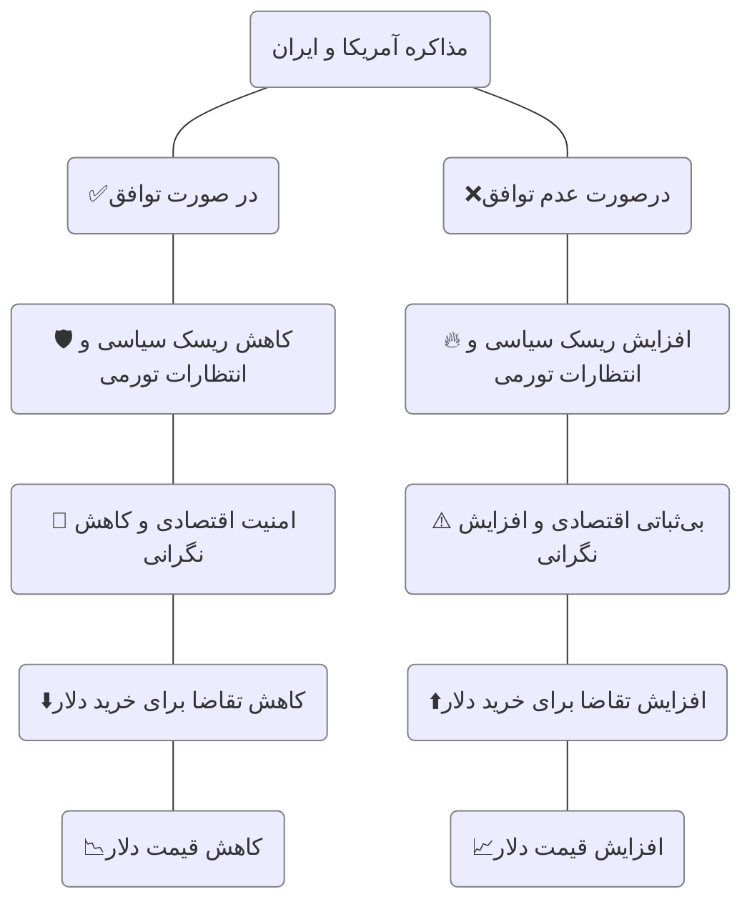

![[pyramid.webp|400]]

در بسیاری از پروژه‌ها و فرایندهای تصمیم‌گیری، با حجم گسترده‌ای از داده‌ها مواجه هستیم که در نگاه اول ممکن است فاقد معنا یا کاربرد مشخصی باشند. مدل DIKW، که مخفف چهار مفهوم Data (داده)، Information (اطلاعات)، Knowledge (دانش) و Wisdom (خرد) است، چارچوبی مفهومی برای درک روند تبدیل داده‌های خام به تصمیم‌گیری‌های آگاهانه و هوشمندانه ارائه می‌دهد.

این مدل به ما نشان می‌دهد که چگونه می‌توان از لایه‌های ابتدایی اطلاعات عبور کرد و در نهایت به بینش و خرد لازم برای اقدامات مؤثر دست یافت. ریشه‌های تاریخی DIKW به سال 1934 بازمی‌گردد، اما در طول زمان توسط پژوهشگران مختلفی توسعه یافته است. نسخه‌ی امروزی این چارچوب عمدتاً به دو نظریه‌پرداز برجسته، **میلان زلنی** و **راسل آکاف**، نسبت داده می‌شود که نقش مهمی در ترویج و گسترش آن ایفا کرده‌اند.

امروزه مدل DIKW در حوزه‌های مختلفی از جمله مدیریت ارتباط با مشتری(CRM) و [[pkm|مدیریت دانش شخصی (PKM)]] مورد استفاده قرار می‌گیرد. 

  

## اجزای هرم DIKW
در هرم دانش چهار بخش وجود دارد که بین داده‌‌ها، اطلاعات، دانش و خرد تفاوت قائل شده است:

**۱. داده (Data):** داده‌ها مجموعه‌ای از واقعیت‌های خام و بی‌ساختار هستند که به‌تنهایی معنا یا ارزشی ندارند. این اطلاعات می‌توانند عدد، کلمه، تصویر یا هر نوع ورودی ثبت‌شده باشند. در این مرحله، هنوز هیچ تحلیل، تفسیر یا ارتباطی میان اجزا برقرار نشده و فقط به‌عنوان مواد اولیه دانش محسوب می‌شوند.

**۲. اطلاعات (Information):** اطلاعات زمانی شکل می‌گیرد که داده‌ها در یک زمینه قرار می‌گیرند و معنادار می‌شوند. پردازش داده‌ها، ارتباط دادن آن‌ها به هم و فهمیدن اینکه به چه چیزی اشاره دارند، داده را به اطلاعات تبدیل می‌کند. در این مرحله می‌توان چیزهایی را توصیف یا گزارش کرد، اما هنوز تفسیر عمیق صورت نگرفته است.

**۳. دانش (Knowledge):** دانش حاصل درک و تفسیر اطلاعات است. در این مرحله، اطلاعات در کنار تجربه، زمینه، و بینش قرار می‌گیرد تا فرد بتواند آن را در عمل به کار بگیرد.

**۴. خرد (Wisdom):** خرد بالاترین سطح در هرم دانش است و به توانایی استفاده سنجیده از دانش در موقعیت‌های مختلف اشاره دارد. خرد شامل قضاوت درست، پیش‌بینی پیامدها، و انتخاب بهترین راه‌حل است. در این سطح، فرد می‌داند چرا کاری باید انجام شود و چه زمانی بهترین زمان برای آن است. در این لایه فرد از «چگونگی» به «چرا» می رسد.

![[DIKW_en.webp|600]]

  

## نمونه‌ای از تحلیل داده در هرم DIKW

برای درک بهتر این مسئله به این مثال توجه کنید:

**داده‌ها:** امروز با مرور اخبار متوجه می شوید که «نرخ دلار در بازار آزاد ۱۰۰,۰۰۰ تومان است». «آمریکا به ایران پیشنهاد مذاکره داده است». اینها داده‌های خام و بدون هیچ تفسیری هستند.

**اطلاعات:** بعد شروع میکنیم به تفسیر این داده‌ها و آن ها در زمینه مشخص قرار می‌دهیم تا معنادار شوند: «با توجه به پیشنهاد مذاکره از سوی آمریکا، بازار ارز ممکن است واکنش نشان دهد. اخبار مثبت دربارهٔ مذاکرات می‌تواند منجر به کاهش نرخ دلار شود». در این مرحله ما رابطه بین داده‌ها را کشف کردیم اما هنوز چرایی و علت آن را نمی‌دانیم.

**دانش:** در مرحله بعد یک الگو را کشف میکنیم: «بخشی از قیمت دلار ناشی از ریسک‌های سیاسی و انتظارات تورمی است. وقتی ریسک‌ها زیاد می شوند اقتصاد بی ثبات می شود و مردم برای حفظ ارزش پول خود ممکن است دلار بخرند. تقاضای خرید زیاد میشود قیمت هم رشد میکند. اما در صورت مذاکره و توافق، تحریم ها رفع می شوند و اقتصاد قابل پیش بینی تر می شود. مردم احساس امنیت میکنند. کمتر دلار می خرند و قیمت دلار افت میکند». در این مرحله می فهمیم چرا چنین چیزی رخ داده و چه رابطه ای بین عوامل مختلف وجود دارد.  

**خرد:** حالا با دانشی که در مرحله قبل کسب کردیم تصمیم هوشمندانه میگیریم: «با در نظر گرفتن اینکه اخبار مثبت دربارهٔ مذاکرات می‌تواند منجر به کاهش نرخ دلار شود، ممکن است تصمیم بگیریم از خرید دلار در این مقطع زمانی خودداری کنیم یا حتی در صورت داشتن دلار، بخشی از آن را بفروشیم تا از کاهش احتمالی دارایی‌ها جلوگیری کنیم».​

به این ترتیب توانستیم با داده های خام و تفسیر درست آنها یک الگو را کشف کنیم و تصمیم های هوشمندانه در بازار ارز بگیریم.

> [!red0] 
> 🚨 این مثال صرفا جهت تقریب ذهن و فهم راحت تر چهار مرحله‌ی دانش مطرح شده است. بدون تردید عوامل بسیار دیگری هم در رشد و کاهش قیمت دلار اثرگذار هستند که در این نمودار به آنها اشاره نشده است.

  

## تحلیل و ارزیابی

این هرم چندان بی عیب و نقص نیست و ایراداتی به آن وارد است. مرزبندی شفاف و دقیقی بین این سطوح وجود ندارد. این سیر خطی از داده تا خرد در همه موارد صادق نیست.

همچنین مراحل آن میتواند کمتر یا بیشتر باشد. خود راسل اکاف که نقش مهمی در ترویج این اصطلاحات داشته یک مرحله دیگر بین دانش و خرد به نام بینش اضافه کرده. ([+](https://nursing-informatics.com/blog/theory-applied-to-informatics-dikw-theory/))

  

---
بیشتر بخوانید:
- [DIKW Pyramid](https://www.jeffwinterinsights.com/insights/dikw-pyramid)
