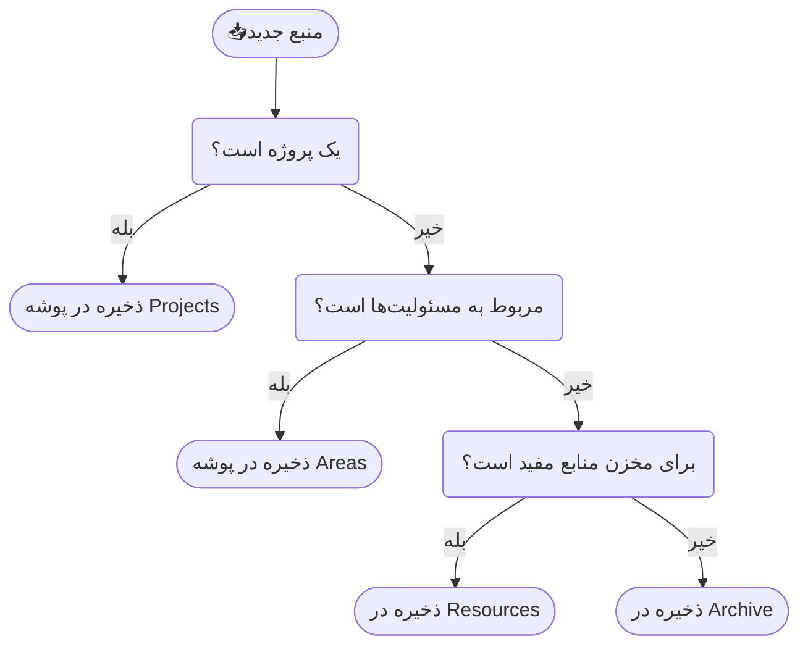

![[second-brain.webp]]

ساختن مغز دوم(Building a Second Brain) اصطلاحی است که **تیاگو فورته** برای مدیریت دانش دیجیتال به کار برد. او کتابی با همین عنوان نوشته و با طراحی فرایند چهار مرحله‌ای تلاش کرده سیستمی مناسب برای علاقه‌مندان به مدیریت دانش معرفی کند.[^1] 

هدف این سیستم بیرون آوردن اطلاعات از ذهن و ذخیره آن‌ها در یک سیستم دیجیتال قابل مدیریت است.

> [!figure]
> ![[basb-book.webp|400]]
> Tiago Forte(تیاگو فورته)


<br>

## فرایند ساختن مغز دوم
تیاگو برای ساختن مغز دوم فرایند چهار مرحله‌ای با نام CODE طراحی کرده است. این اصطلاح مخفف چهار کلمه‌ای است که مراحل این سیستم را تشکیل می‌دهند: Capture, Organize، Distill, Express.

### ۱. Capture(ثبت)
در این مرحله اطلاعات مهم را ثبت و ذخیره می‌کنید.

<br>

### ۲. Organize(سازمان‌دهی)
تیاگو برای سازماندهی روش PARA را معرفی می‌کند که از چهار بخش تشکیل شده:
1. **Projects(پروژه‌ها):** کارهایی که هدف مشخص دارند و در یک بازه زمانی تمام می‌شوند. مثلاً: طراحی سایت، نوشتن مقاله، اجرای یک کمپین.
2. **Areas(حوزه‌های مسئولیت):** بخش‌هایی از زندگی یا کار که دائمی هستند و همیشه باید به آن‌ها رسیدگی شود. مثلاً: سلامت، مالی، یادگیری، کار.
3. **Resources(منابع):** موضوعات و اطلاعاتی که فعلاً پروژه فعال نیستند اما برای آینده یا علاقه شخصی نگهداری می‌شوند.
4. **Archive(آرشیو):** هر چیزی که فعلاً استفاده نمی‌شود اما باید نگهداری شود؛ مثل پروژه‌های تمام‌شده یا منابع غیر فعال.

<br>

### ۳. Distill(عصاره‌گیری)
در این مرحله تلاش می‌کنید اطلاعاتی که ذخیره کردید به تدریج به نسخه‌ای واضح‌تر و کاربردی‌تر تبدیل شوند. تیاگو روش خلاصه سازی تدریجی را برای این مرحله توصیه می‌کند. یعنی اول متن کامل ذخیره می‌شود. سپس نکات مهم هایلایت می شوند و در نهایت یک خلاصه‌ی شخصی و فشرده از آن آماده می‌شود. 

<br>

### ۴. Express(یا بیان)
در این مرحله تلاش می کنید از اطلاعاتی که دریافت کردید خروجی ارزشمند تولید کنید. مغز دوم زمانی معنا پیدا می‌کند که اطلاعات ذخیره‌شده به جای انبار شدن به کار گرفته شوند.

<br>

## جریان کار مغز دوم
برای استفاده از سیستم مغز دوم نیاز به ابزار پیچیده‌ای ندارید، فقط این پنج بخش را ایجاد کنید:
```
📥Inbox
✅Projects
🔭Areas
📚Resources
🗄️Archive
```

ایده‌ها و نوشته‌های جدید را در Inbox ثبت کنید. طبق این چارت در زمان مناسب آن را به بخش مربوطه منتقل کنید:



برای اثر بخشی این سیستم باید برخی از اقدامات به طور منظم انجام شوند:

هفته‌ای یکبار inbox را خالی کنید.

ماهانه پوشه Areas و Resources را بررسی کنید.

میزان اهمیت و فوریت وظایف را بروزرسانی کنید.

<br>

%% 
مخاطب سیستم مغز دوم 
افرادی که بین حجم منابع و اطلاعات زیاد سردرگم شده اند. افرادی که اطلاعات شخصی و پروژه های خود را مدیریت کنند.

## ارزیابی و مقایسه سیستم مغز دوم

 BASB سیستمی برای مدیریت منابع است؛ ZKM روشی برای کار با خود ایده‌هاست.

مدیریت اطلاعات و پروژه هاست نه مدیریت دانش.
%%


<br>

## برای مطالعه‌ی بیشتر
- [Build a second brain](https://workflowy.com/systems/build-a-second-brain)
- [PARA Method](https://workflowy.com/systems/para-method)
- [Building a Second Brain: The Illustrated Notes](https://maggieappleton.com/basb)
- [How to Increase Knowledge Productivity: Combine the Zettelkasten Method and Building a Second Brain](https://zettelkasten.de/posts/building-a-second-brain-and-zettelkasten/)


[^1]: هرچند تیاگو فورته نقش مهمی در محبوب‌سازی واژه‌ی **مغز دوم** داشت اما این استعاره پیش از این نیز توسط افراد مختلفی مطرح شده است. مثلا در مقاله‌ی ذهن گسترش‌یافته([The Extended Mind](https://www.jstor.org/stable/3328150)) کلارک و دیوید چالمرز ادعایی را در مورد رابطه‌ی انسان با دفترچه‌یاددشتش مطرح می کنند که دفترچه هم بخشی از ذهن ماست اما بیرون از جمجمه است.([+](https://motamem.org/%d8%af%d9%81%d8%aa%d8%b1%da%86%d9%87-%db%8c%d8%a7%d8%af%d8%af%d8%a7%d8%b4%d8%aa-%d8%a7%d9%86%d8%af%db%8c-%da%a9%d9%84%d8%a7%d8%b1%da%a9/))
