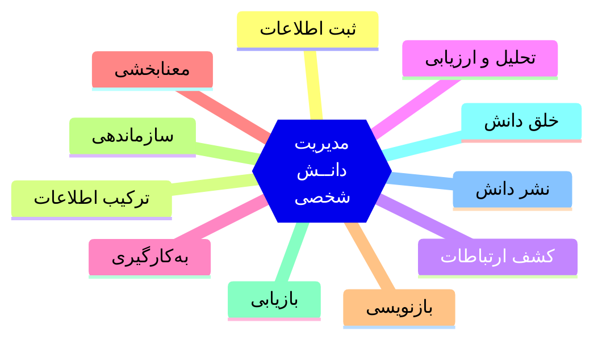
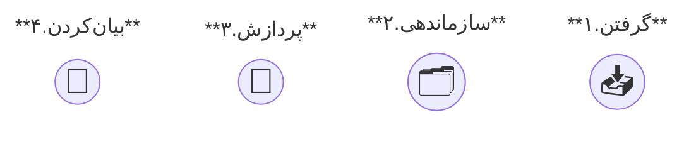

![[pkm.webp]]

مدیریت دانش شخصی مجموعه‌ای از فعالیت‌هاست که یک نفر برای جمع‌آوری، سازماندهی، به کارگیری و بازیابی دانش خود به کار می‌گیرد.[^7]

مدیریت دانش شخصی کمک می‌کند تا اطلاعات را به دانش مفید تبدیل کرده و به سطح مطلوبی از آگاهی و خرد برسیم.


<br> 

## چرا به مدیریت دانش شخصی نیاز داریم؟  
در دنیای امروز ما با حجم زیادی از اطلاعات مواجه هستیم. روزانه هزاران داده از تلویزیون، رادیو، موبایل، روزنامه‌ها و رسانه‌های دیگر به سمت ما سرازیر می‌شوند.[^1] ما میان این داده‌ها سردرگم می‌شویم. محتوای بی‌فایده مصرف می‌کنیم که هیچ ارزشی ندارد.

اگر هم اطلاعات مفیدی کسب کنیم بسیاری از آنها گم می‌شوند، دقیقا در لحظه‌ای که به آن نیاز داریم نمی‌توانیم آن را پیدا کنیم. بسیاری از اطلاعات فراموش می‌شوند، اصلا یادمان می‌رود که چنین مطلبی را خوانده بودیم.

امروز **چالش دانش کسب آن نیست**. در عصر دیجیتال می‌توانید هر چیزی را یاد بگیریم. چالش این است که بدانیم چه چیزی ارزش یادگیری دارد، چطور آن‌ها را به‌کار بگیریم و به دانش مفید تبدیل کنیم.

امروز دانش به کالایی تبدیل شده که همه به آن دسترسی دارند. تسلط موتورهای جستجو و هوش مصنوعی به مراتب از ما بیشتر است. پس در این دوره دانستن قطعه‌ای از دانش مزیتی ندارد. در این عصر داشتن خرد و بینش اهمیت پیدا می‌کند. [^2]

**مدیریت دانش شخصی** راهکاری است که می‌تواند از آشفتگی ذهنی و انبارکردن اطلاعات جلوگیری کند. مدیریت دانش کمک می‌کند داده‌های مفید را ذخیره کنیم، به آن‌ها معنا بدهیم و از آنها برای تصمیم‌گیری بهتر در زندگی استفاده کنیم.


<br> 

## چگونه دانش شخصی را مدیریت کنیم؟
مدیریت دانش شخصی شامل فعالیت‌های متعددی است:




برای انجام این فعالیت‌ها به فرایندی نیاز داریم تا بتوانیم تمامی این فعالیت‌ها را کامل و به ترتیب اجرا کنیم. برای مدیریت دانش شخصی فرایند مشخصی وجود ندارد، هرکسی با توجه به نیاز و ترجیحات خود فرایند متفاوتی طراحی کرده است. 

فرایندی که من برای مدیریت دانش استفاده می‌کنم شامل چهار مرحله[^6] است:



این چهار مرحله به خوبی فعالیت‌های لازم برای مدیریت دانش شخصی را پوشش می‌دهد. همچنین همخوانی نسبتا خوبی با مدل [[dikw-pyramid|هرم دانش]] دارد. این هرم که توسط **میلان زلنی** و **راسل آکاف** توسعه یافته به ما نشان می‌دهد چگونه می‌توان از لایه‌های ابتدایی اطلاعات عبور کرد و به سطح بالاتری از دانش رسید.

![[DIKW_en.webp|600]]

در این هرم چهار لایه وجود دارد: داده‌، اطلاعات، دانش و خرد. در فرایند چهار مرحله‌ای تلاش می‌کنیم داده‌های دریافتی را ثبت کنیم. با سازماندهی و معنا بخشی آنها را به اطلاعات تبدیل کنیم. با پردازش و به کارگیری اطلاعات را به دانش تبدیل کنیم. با خلق کردن و بیان کردن دانسته‌ها را عمیق‌تر کنیم و به خرد برسیم.[^5]

<br><br>

## فرایند مدیریت دانش شخصی

### مرحله اول: گرفتن(Capture)
در این مرحله داده‌ها را دریافت و ذخیره می‌کنیم. برای ذخیره‌سازی داده‌ها می‌توانیم از [[note-taking|یادداشت برداری]] استفاده کنیم. وقتی چیزی را می‌نویسیم، آن را به بند می‌کشیم و اجازه نمی‌دهیم به سادگی از ذهنمان فرار کند. تجربه نشان داده اینکه فقط به مطالعه بسنده کنیم و امیدوار باشیم در ذهنمان باقی بماند، روش مطمئنی نیست و معمولا نتیجه نمی‌دهد.

علاوه بر این برای ادامه‌ی مسیر یادگیری نیاز به یک ماده خام داریم، چیزی که بتوانیم روی آن کار کنیم. این نوشته‌ها همان ماده‌ی اولیه هستند.

پس یک قلم و کاغذ بردارید یا اگر ترجیح می‌دهید به صورت دیجیتالی آموخته‌های خود را بنویسید. مهم این است که دانسته‌هایتان جایی ثبت شوند و در دسترس باشند.

<br> 

> 📖 پیشنهاد مطالعه: در [[note-taking|یادداشت برداری]] در مورد موضوع این توضیحات کامل‌تری نوشته‌ام:
> ```cardnote
> {
>   "title": "یادداشت برداری",
>   "image": "/assets/images/note-taking.webp",
>   "link": "./note-taking"
> }
> {  
> "empty": true  
> }
> ```

<br>

### مرحله دوم: سازماندهی‌کردن(Organize)
بعد از دریافت داده‌ها، باید آنها را در زمینه‌های مناسب قرار بدهیم تا معنادار شوند.با [[organizing-notes|سازماندهی یادداشت‌ها]] باید تلاش کنیم جایگاه مطالب را در ذهنمان مشخص کنیم. باید ارتباط مطالب جدید را با دانسته‌های قبلی کشف کنیم. تنلبار کردن داده‌ها کمکی به یادگیری نمی‌کند.

بهتر است به جای ساختار سلسه مراتبی(پوشه بندی) از ساختار شبکه‌ای برای سازماندهی استفاده کنیم. در این ساختار تلاش می‌کنیم با [[linking|لینک‌دهی]] یادداشت‌های مرتبط را به هم پیوند بزنیم و شبکه‌ای از اطلاعات بسازیم.

<br> 

> 📖 پیشنهاد مطالعه:
> ```cardnote
> {
>   "title": "سازماندهی یادداشت‌ها",
>   "image": "/assets/images/organizing-note.webp",
>   "link": "./organizing-notes"
> }
> {
>   "title": "لینک‌دهی، ایجاد ارتباط بین یادداشت‌ها",
>   "image": "/assets/images/linking.webp",
>   "link": "./linking"
> }
> ```

<br> <br> 

### مرحله سوم: پردازش‌کردن(Process)
بیشتر اوقات بعد از یادداشت‌برداری، نوشته‌های‌مان را به حال خود رها می‌کنیم و دیگر به سراغشان نمی‌رویم.

برای اینکه افکار و ایده‌های‌تان رشد کنند و به باربنشینند، باید به طور مداوم به آن‌ها رسیدگی کنید؛ درست مثل مراقبت از یک باغ. بعد از کاشت بذر، نمی‌توانیم انتظار داشته باشیم که گیاهان به خودی خود رشد کنند و محصول بدهند. آن‌ها به آبیاری، نور خورشید و حذف علف‌های هرز نیاز دارند. به همین ترتیب، یادداشت‌ها هم نیاز به بازبینی، اصلاح و ویرایش دارند. با مراقبت و توجه مداوم، می‌توانید اطمینان حاصل کنید که بذر افکار و ایده‌های‌تان نه تنها ازبین نمی‌روند، بلکه رشد می‌کنند و به ثمر می‌نشینند. 

باید به طور منظم به یادداشت‌های‌تان سر بزنید، آن‌ها را ارزیابی کنید و تغییرات لازم را اعمال کنید. اگر چیزی نیاز به حذف یا اضافه شدن دارد، آن را انجام دهید. اگر روابط جدیدی کشف کردید آن‌ها را مشخص کنید. اگر مطالب به اندازه کافی رشد نکرده‌اند با دقت و رسیدگیِ بیشتر تلاش کنید آن‌ها را ارتقاء دهید. 

یکی از اقدامات موثر در این مرحله [[note-making|یادداشت سازی]] است. با این کار یک قدم از یادداشت برداری فراتر می‌روید. یادداشت سازی یک مرحله‌ی پیشرفته‌تر است که در آن تلاش می‌کنید دانسته‌های‌تان را یک کاسه کنید.


دانسته‌ها اگر فراموش نشوند لزوما به مرحله عمل نمی‌رسند. با انجام فعالیت‌های مولد در این مرحله تلاش می‌کنیم آنچه را آموختیم به کار ببندیم و زندگی‌شان کنیم.

```cardnote
{
  "title": "یادداشت سازی",
  "image": "/assets/images/note-making.webp",
  "link": "./note-making"
}
{  
"empty": true  
}
```

%%
بازنویسی بشه. مثلا طبق مدل بلوم اقدامات پیشنهادی مثل به کاربستن، فهمیدن تحلیل ترکیب و ارزشیابی داشته باشه
با فعالیت های مولد باید آنچه را آموختیم به کار ببندیم. فعالیت های مولد رو مثال بزنم و توضیح بده.
این متن از دیجیتال گاردن کپی شده بازنویس بشه یا متن اونجا بازنویسی بشه

%%

<br> 

### مرحله چهارم: بیان‌کردن(Express)
در این مرحله تلاش می‌کنیم از ورودی‌ها خروجی بگیریم. با روش های مختلف تلاش می‌کنیم آنچه را یادگرفتیم بیان کنیم. البته بهتر است این بیان کردن عمومی باشد. [[learn-in-public|یادگیری در ملأعام]] مفهومی است که توصیه می کند فرآیند یادگیری‌مان را عمومی کنیم و بگذاریم دیگران هم ببینند چطور یاد می‌گیریم، چه چیزهایی می‌فهمیم، و چه چیزهایی هنوز برایمان مبهم‌اند. این کار باعث می‌شود بازخورد بگیریم و اشتباهاتمان را بهتر بشناسیم.

```cardnote
{
  "title": "یادگیری در ملأعام",
  "image": "/assets/images/learn-in-public.webp",
  "link": "./learn-in-public"
}
{  
"empty": true  
}
```

نشر و بیان دانش به شکل ‌های متعددی انجام است. می توانید جستار، مقاله یا کتاب بنویسید. همچنین می توانید به دیگران آموزش بدهید. وقتی چیزی را به کسی آموزش می‌دهیم، در واقع خودمان هم بهتر یاد می‌گیریم. تدریس یکی از بهترین روش‌ها برای عمیق کردن یادگیری است. حتی اگر کسی را پیدا نکردید به خوتان توضیح دهید. 
%% نیاز به بازنویسی داره %%

<br><br> 
## اصول و قواعد مدیریت دانش شخصی

### اصل اول: دور ذهن‌تان حصار بکشید
هر محتوایی صلاحیت حضور در ذهن‌ما را ندارد. نباید اجازه دهیم مغزمان با اطلاعات بیهوده و بی‌ارزش اشغال شود. باید با دقت انتخاب کنیم و به مطالب سطحی و بی‌فایده اجازه‌ی ورود ندهیم.

البته این به معنای کم‌خوانی و دوری از یادگیری نیست. مثل یک فرمانروای کشورگشا ما هم به محتواهای معتبر و ارزشمند حمله می‌کنیم و آن‌ها را تصاحب می‌کنیم؛ اما یک فرمانروای زیرک هرگز نیروهای خود را برای تصرف زمین‌های بایر و لم‌یزرع نمی‌فرستد، آنها به سرزمین‌هایی هدایت می‌کند که غنی‌ترین منابع را دارد.

پس حصار کشیدن به معنای محدود کردن و جلوگیری از توسعه دانش نیست، بلکه روشی هوشمندانه برای حفاظت و نگهداری از خزانه‌ی دانش ماست.

اگر می‌خواهید در آینده بهتر یاد بگیرید، باید از همین امروز روی ورودی‌های ذهنتان حساس باشید. چه می‌خوانید؟ چه می‌بینید؟ با چه چیزهایی ذهن‌تان را تغذیه می‌کنید؟ غذاهای سریع الهضم به دانش مفید تبدیل نمی شوند.

باید حرف مهم را از **نویز** تشخیص بدهید. نویزها مانع دیدن می‌شوند. *«منظور از نویز، اخبار و گزاره‌های بی‌فایده‌ای است که مدام از این‌طرف و آن‌طرف، ناخواسته به ذهن خورانده می‌شوند. تأثیر این نویزها، درست مثل نویزهای صوتی و تصویری، در ابتدا آزاردهنده و در حالت شدیدش خطرناک است. شدت نویزهای ذهنی گاهی به قدری زیاد می‌شود که انسان به کلی از کارش می‌ماند و اصلاً یادش نمی‌آید که چرا و چطور درگیر این نویزها شده است».* ([+](https://blog.eledah.ir/expressions/noise))

امروز دنیای دیجیتال طوری طراحی شده که همه بر سر تصاحب کردن توجه ما با یکدیگر رقابت می‌کنند. باید توجه خود را مدیریت کنید و اجازه ندهید هرکسی این منبع ارزشمند را هدر دهد. 


> 📖 پیشنهاد مطالعه: در [[attention-management|مدیریت توجه]] راهکارهای مناسبی برای مدیریت توجه معرفی کردم:
> ```cardnote
> {
>   "title": "مدیریت توجه",
>   "image": "/assets/images/attention-management.webp",
>   "link": "./attention-management"
> }
> {  
> "empty": true  
> }
> ```


<br> 

### اصل دوم: پیشینه یادگیری در یادگیری اثر دارد

داده‌ها نقش بسیار کلیدی در شکل‌گیری دانش‌ما دارند. کیفیت دانش‌ما به کیفیت همین داده‌ها بستگی دارد.  هر چه داده‌ها مفید‌تر و باکیفیت‌تر باشند دانش‌ما غنی‌تر و کارآمدتر است. کیفیت خروجی یک سیستم به کیفیت ورودی آن بستگی دارد.

آیزاک نیوتون در نامه‌ای به رابرت هوک نوشت: «اگر در مقایسه با دیگران چیزهای بیشتری می‌بینم به این دلیل است که روی شانه‌های غول ایستاده‌ام». ([+](https://en.wikipedia.org/wiki/Standing_on_the_shoulders_of_giants))

این جمله استعاره‌ای از **کشف حقیقت بر پایه‌ی اکتشافات قبلی** است. یعنی دانسته‌های پیشین ما زمینه‌ای فراهم می‌کنند تا یادگیری‌مان عمیق‌تر و مؤثرتر باشد. [^3]

پیشینه یادگیری، مجموعه‌ای از اطلاعات، تجربیات و دانسته‌هایی است که پیش از یادگیری یک مطلب جدید در ذهن ما انباشته شده‌اند. این پیشینه مثل خاک آماده‌ای‌ست که بذرهای دانایی در آن رشد می‌کنند. اگر این خاک غنی نباشد، حتی بهترین بذرها هم ممکن است ثمر ندهند.

**یادگیری مثل تجارت است.** تاجر هرچه سرمایه اولیه بیشتری داشته باشد می‌تواند معامله‌های بهتری انجام دهد. مغز ما هم همینطور است. هرچه اطلاعات پایه‌ای بیشتر و عمیق‌تری داشته باشیم بهتر می‌توانیم دانسته‌های جدید را بفهمیم و با آن ارتباط برقرار کنیم. هرچه ورودی‌های ذهن ارزشمندتر و دقیق‌تر باشند رأس المال و سرمایه اولیه ذهن ما بیشتر می‌شود.[^4]

<br> 

### اصل سوم: فرایندها را پیچیده نکنید
مراقب باشید در دام فرایندهای پیچیده و عجیب و غریب نیفتید. فرایند پیچیده وقت و ذهن شما را می‌بلعد! فعالیت‌هایی که برای نظم‌دادن به اطلاعات به کار می‌برید باید ساده و بی‌دردسر باشد؛ کارتان را سبک‌تر کند و زمان بیشتری در اختیارتان بگذارد، نه اینکه وقت و انرژی‌تان را بگیرد.

<br> 

### اصل چهارم: سیستم تغییر می‌کند و به تدریج کامل می شود
شما به تدریج تغییر می‌کنید. افکار شما مدام عوض می‌شود. یادداشت‌ها باید اصلاح و بازنویسی شوند. حذف و اضافه مطالب طبیعی است. سیستم انتخابی شما نباید مانع این کار شود.

سخت گیری نکنید. ابتدای مسیر ممکن است همه چیز به هم ریخته و شلخته باشد. با گذشت زمان ساختار برای مدیریت نوشته‌های‌تان را پیدا خواهید کرد.

<br> 

### اصل پنجم: متن جنریت شده با هوش مصنوعی را برای نوشته‌های تان ممنوع کنید
در زمان ما که هوش مصنوعی فراگیر شده احتمالا شما هم مثل من وسوسه شدید که بخشی از مراحل قبلی را به آنها بسپارید. یعنی مدل‌ها خلاصه کنند، یادداشت بردارند و تحلیل بنویسد. در یادداشت [[pkm-with-ai|مدیریت دانش شخصی با هوش مصنوعی]] اشاره کردم که متنی که مدل زبانی تولید می‌کند هیچ‌وقت ذهن را درگیر نمی‌کند. وقتی نوشتن را به مدل واگذار می‌کنیم در واقع مغزمان را از پردازش عمیق محتوا محروم کرده‌ایم.

<br><br> 
## سیستم‌های متداول مدیریت دانش
برای مدیریت دانش شخصی سیستم‌های متعددی طراحی شده است. هر کدام از این سیستم‌ها از اصول خاصی پیروی می‌کنند. اگر ابتدای مسیر مدیریت دانش هستید می‌توانید این موارد را با دقت مطالعه کنید و روشی که با نیاز شما همخوانی بیشتری دارد را انتخاب کنید. 

البته لزوما قرار نیست از یکی از سیستم های موجود پیروی کنید. شما می توانید بر اساس نیاز و علاقه خود سیستم مناسب خودتان را طراحی کنید. از ایده ها و ساختارهای هر کدام الهام بگیرید و سیستم شخصی خودتان را کارآمد کنید.  برای اینکه نیاز و شخصیت خودتان را بیشتر بشناسید پیشنهاد می کنم [[your-note-style|شخصیت شما در یادداشت برداری]] را مطالعه کنید:
```cardnote
{
  "title": "شخصیت شما در یادداشت برداری",
  "image": "/assets/images/your-note-style.webp",
  "link": "./your-note-style"
}
{  
"empty": true  
}
```

<br>

### زتلکاستن(Zettelkasten)
این سیستم توسط فیلسوف آلمانی نیکلاس لومان طراحی شده است. زتلکاستن یک سیستم شبکه‌ای برای یادداشت‌برداری و تفکر عمیق است. هر یادداشت به صورت مستقل و با لینک به یادداشت‌های مرتبط ساخته می‌شود، تا ارتباط بین ایده‌ها حفظ شده و دسترسی به اطلاعات آسان‌تر شود.([+](https://zettelkasten.de/overview/))

<br> 

### دیجیتال گاردن(Digital Garden)
[[digital-garden|دیجیتال گاردن]] روشی است که بر پایه استعاره باغبانی شکل گرفته است. تصور کنید یک زمین حاصل‌خیز دارید که بذر دانش را در آن می‌کارید. محتوایی که مطالعه می‌کنید همچون خاک بستر رشد بذر‌ها را فراهم می‌کند. هر بذری که می‌کارید در این خاک ریشه دوانده و از آن تغذیه می‌کند.

شما به‌عنوان باغبان از این بذرها مراقبت کرده و آن‌ها پرورش می‌دهید. پس از جوانه‌زدن و رویش شاخه‌ها و برگ‌ها، قسمت‌های اضافی و زائد را هرس می‌کنید. آن‌ها را پیوند می‌زنید و در نهایت محصول آن را برداشت کرده و به دیگران عرضه می‌کنید.

این روش هم ساختار شبکه‌ای را توصیه می کند.‌

```cardnote
{
  "title": "دیجیتال گاردن",
  "image": "/assets/images/digital-garden.webp",
  "link": "./digital-garden"
}
{  
"empty": true  
}
```
<br> 

### ساختن مغز دوم (Building a Second Brain
[[second-brain|ساختن مغز دوم]] توسط تیاگو فورته طراحی شده است.  هدف این سیستم بیرون آوردن اطلاعات از ذهن و ذخیره آن‌ها در یک سیستم دیجیتال قابل مدیریت است. این روش به شما کمک می‌کند ایده‌ها، یادداشت‌ها، پروژه‌ها و منابع مختلف را به‌صورت منظم و ساختاریافته نگه دارید تا هر زمان که نیاز داشتید، سریع به آن‌ها دسترسی پیدا کنید.

این روش چندان تحت ساختار سلسله مراتبی نیست، اما اصراری هم بر لینک دهی و ساختن شبکه اطلاعات ندارد.

```cardnote
{
  "title": "ساختن مغز دوم",
  "image": "/assets/images/second-brain.webp",
  "link": "./second-brain"
}
{  
"empty": true  
}
```

<br> 

### روش GTD (Getting Things Done)
این روش اساسا برای مدیریت کارهاست. در واقع روشی برای مدیریت اطلاعات شخصی(PIM) است اما در مدیریت دانش هم استفاده می‌شود. روش ساختن مغز دوم هم با الهام از همین روش بوده است.([+](https://gettingthingsdone.com/what-is-gtd/))

<br><br>

## منابع برای مطالعه بیشتر
- [Awesome Knowledge Management](https://github.com/brettkromkamp/awesome-knowledge-management): فهرستی گلچین شده از مقالات، افراد، نرم‌افزارها و پروژه ها در زمینه مدیریت دانش
- [It's Not You - It's Your Knowledge Base](https://www.kevinslin.com/notes/e1455752-b052-4212-ac6e-cc054659f2bb/): یک نوشته خوشخوان با تصویری سازی های بامزه
- [Implementing a ‘Wisdom Engine’ for Personal Knowledge Management](https://asksensay.medium.com/implementing-a-wisdom-engine-for-personal-knowledge-management-3c76b8d8f760): مطلب نسبتا طولانی هست در مورد رسیدن به خرد با استفاده از LLM


<br><br> 


[^1]: بنابر گزارش **دانشگاه کالیفرنیا، سن دیگو** یک آمریکایی در سال 2009  روزانه 34 گیگابات معادل 100,000 کلمه اطلاعات مصرف می‌کند.([+](https://library.ucsd.edu/dc/object/bb45115878/_1.pdf))

[^2]: تیاگو فورته در کتاب پارامتد ادعا کرده عصر دانشورز رو به پایان است: «برای دهه‌ها ما خودمان را دانشورز(Knowledge Worker) نامیده‌ایم، بر اساس این واقعیت که دانش دارایی اصلی ما بود... اما اکنون در حال ورود به عصر خردورز(Wisdom Worker) هستیم.» <br> اصطلاح دانشورز([Knowledge Worker](https://en.wikipedia.org/wiki/Knowledge_worker))  ابتدا در نوشته های **پیتر دراکر** ظاهر شد. کار دانش‌محور شامل طیف گسترده‌ای از حرفه‌ها است. از توسعه‌دهندگان نرم‌افزار و تحلیلگران مالی گرفته تا ارائه‌دهندگان خدمات بهداشتی و محققان. آنها به جای دست با ذهن خود کار می‌کنند. <br> درسال 1999 دراکر در کتاب «چالش های مدیریت در قرن21ام» مدعی شد: «با ارزش ترین دارایی یک نهاد در قرن 21 کارکنان دانش‌محور خواهند بود.» <br> در دسته بندی مشاغل افراد دانشورز در گروه یقه طلایی قرار می‌گیرند( [+](https://fa.wikipedia.org/wiki/%D9%85%D8%B9%D8%B1%D9%81%DB%8C_%DA%A9%D8%A7%D8%B1%DA%AF%D8%B1%D8%A7%D9%86_%D8%A8%D8%B1_%D8%A7%D8%B3%D8%A7%D8%B3_%D8%B1%D9%86%DA%AF_%DB%8C%D9%82%D9%87)). برخی مدعی شدند AI بیشتر مشاغل یقه سفید و طلایی را تحت تاثیر قرار می‌دهد، اما یقه آبی مقاوم‌تر است. ([+](https://www.nbcnews.com/business/business-news/ai-which-jobs-are-skilled-trades-protected-what-to-know-rcna223249)| [+](https://www.axios.com/2025/05/28/ai-jobs-white-collar-unemployment-anthropic)| [+](https://builtin.com/artificial-intelligence/ai-blue-collar-jobs)) <br> با این وجود هرچند ادعای تیاگو فورته در مورد به پایان رسیدن دوران کار دانش‌محور بی‌راه نیست اما کمی اغراق آمیز است. ما به جای اینکه شاهد منسوخ شدن کار دانش‌محور باشیم در حال تجربه تکامل آن هستیم. هوش مصنوعی در حال جایگزینی وظایف تکراری دانش‌ورزان است. <br> در [این نوشته](https://steventennies.substack.com/p/is-the-era-of-the-knowledge-worker) می‌توانید نقد ادعای فورته را مفصل‌تر بخوانید. خلاصه‌اش این است که فورته حرف پیتر دراکر را درست نفهمیده و یک دوگانگی کاذب بین دانش و خرد ایجاد کرده است. دراکر هم احتمالاً با این دیدگاه موافق بود که دانش چیزی بیش از اطلاعات خام است؛ دانش شامل کاربرد تخصصی برای خلق ارزش است.

[^3]: احتمالا شما هم در کلاس‌های آموزشی دیده‌اید؛ برخی سریع مطلب را درک می‌کنند و از توضیح دوباره استاد کلافه می‌شوند، درحالی که برخی دیگر گیج می‌زنند و مدام سوال می‌پرسند. این تفاوت از کجا می‌آید؟ شاید فکر کنید نفر اول باهوش و نفر دوم خنگ است. اما یک احتمال دیگر هم وجود دارد و آن **پیشینه یادگیری** است. (کتاب یادگیری زایا، ص19)

[^4]: مرحوم مظفر در کتاب المنطق از اصطلاح رأس المال برای توصیف این وضعیت استفاده می کند: «ضروریات (بدیهیات) خودبه‌خود در اختیار انسان هستند و این‌ها رأس‌المال اصلی او برای کسب علوم نظری‌اند. انسان با این سرمایه، مفاهیم جدید را فرا می‌گیرد. هرچه بیشتر بیاموزد، رأس‌المالش بیشتر می‌شود و در نتیجه توان بیشتری برای یادگیری مطالب جدید پیدا می‌کند؛ همان‌طور که تاجر با افزایش سرمایه‌اش، توان سودآوری بیشتری پیدا می‌کند.» ([المنطق، جلد1، صفحه 24](https://lib.eshia.ir/10463/1/24))

[^5]:  لزوما قرار نیست همه‌ی داده‌ها این مراحل را طی کنند. بعضی از منابع اصلا ارزش این همه وقت گذاشتن ندارند. ممکن است بعضی از داده‌ها در مرحله اطلاعات باقی بمانند. همه مطالب قرار نیست به بالاترین سطح برسند. به قول فرانسیس بیکن: «بعضی از کتاب‌ها را باید چشید، بعضی دیگر را باید بلعید، و تعداد کمی را باید جوید و هضم کرد؛ یعنی بعضی از کتاب‌ها را باید فقط در بخش‌هایی خواند؛ بعضی دیگر را باید خواند، اما نه با کنجکاوی؛ و تعداد کمی را باید به‌طور کامل، با پشتکار و توجه خواند.» ([+](https://www.goodreads.com/quotes/1242120-some-books-are-to-be-tasted-others-to-be-swallowed))
	

[^6]: این چهار مرحله در واقع همان فرایند چهار مرحله‌ای CODE است که توسط تیاگو فورته طراحی شده اما من ترجیح دادم در مرحله سوم به جای عصاره گیری(Distill) از پردازش استفاده کنم. در این مرحله من اقدامات بیشتری انجام می‌دهم که واژه‌ی عصاره گیری شامل آنها نمی‌شود.

[^7]: در کنار مدیریت دانش شخصی یک اصطلاح دیگر هم وجود دارد: مدیریت اطلاعات شخصی(Personal Information Management). مدیریت اطلاعات اغلب شامل ذخیره و سازماندهی گزارش‌ها، فاکتورها، عکس‌ها، پروژه‌ها و تسک‌ها است که چندان عمیق نیست و بیشتر جنبه‌ی خصوصی دارد. در مقابل مدیریت دانش اغلب شامل یادداشت برداری، تحیل و ارزیابی، به کارگیری و نشر دانش است که جنبه‌ی عمیق‌تری دارد. امروزه این تفکیک کمرنگ شده و این دو مفهوم یک کاسه شده‌اند. یعنی در مدیریت دانش شخصی، داده‌ها هم از جنس اطلاعات شخصی هستند هم از جنس دانش. با توجه به تنوع مطالب فکر می‌کنم این تفکیک دیگر ضرورت ندارد چون نمی‌توان مرز مشخصی برای تفکیک اطلاعات از دانش تعریف کرد. در روشی که تیاگو فورته با عنوان ساخت مغز دوم طراحی کرده می‌توانید ادغام این دو مفهوم را به خوبی مشاهده کنید. چارچوبی که برای سازماندهی در این روش تعریف شده هم شامل دانش است هم اطلاعات.
