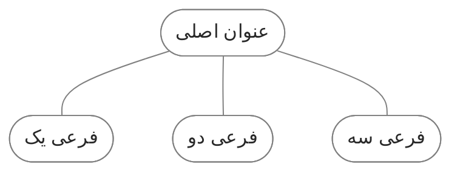

در طول استفاده از کوارتز، به مرور زمان تغییرات و اصلاحات مختلفی برای سفارشی‌سازی سایت انجام دادم. در این یادداشت فهرستی از این تغییرات را مستند کردم. این موارد نخست به عنوان یک مرجع شخصی عمل می‌کند تا در صورت نیاز بتوانم به راحتی تنظیمات قبلی را ویرایش کنم. از طرف دیگر می‌تواند راهنمای مفیدی باشد برای کسانی که تمایل دارند مشابه آن را روی سایت خود پیاده‌سازی کنند.

<br> <br>

## ۱. متاداده‌های یادداشت
متاداده اطلاعات مربوط به یک یادداشت است که بعد از عنوان اصلی نمایش داده می شود. مثل تاریخ انتشار زمان تقریبی مطالعه. من ترجیح دادم تنظیمات زیر را به آن اضافه کنم:
<br><br>
### زمان تقریبی مطالعه
بنا به دلایلی[^1] زمان تقریبی مطالعه را غیر فعال کردم. یک ویرگول هم برای جدا سازی این اطلاعات بین آن ها قرار می‌گرفت که آن را هم مخفی کردم. با اضافه کردن دستور زیر به فایل `quartz.layout.ts` نمایش این دو مورد غیرفعال می‌شود.


```ts title="quartz.layout.ts"
Component.ContentMeta({showReadingTime: false, showComma: false,})
```

<br>

### تاریخ
به طور پیشفرض کوارتز فقط یک تاریخ را به کاربر نشان می‌دهد که نهایتا می توانید زمان آن را روی تاریخ انتشار یا تاریخ آخرین آپدیت تنظیم کنید. من تمایل داشتم علاوه بر تاریخ انتشار، تاریخ آخرین به‌روزرسانی هم برای کاربر قابل مشاهده باشد. با این دستور درصورتی که تاریخ انتشار و آخرین به‌روزرسانی یکسان نباشد علاوه بر تاریخ انتشار، تاریخ آخرین به‌روزرسانی هم به کاربر نمایش داده می‌شود. 

برای تاریخ انتشار باید از پراپرتی date و برای تاریخ آخرین به روزرسانی باید از پراپرتی lastmod در یادداشت خود استفاده کنید.

```tsx title="quartz/components/ContentMeta.tsx"
    if (text) {
      const segments: (string | JSX.Element)[] = []

      if (fileData.frontmatter) {
        const created = fileData.frontmatter.date ? formatDate(new Date(fileData.frontmatter.date), cfg.locale) : null
        const lastmod = fileData.frontmatter.lastmod ? formatDate(new Date(fileData.frontmatter.lastmod), cfg.locale) : null        
      
        if (created) {
          segments.push(` 📅 انتشار: ${created} `)
        }
        if (lastmod && created !== lastmod) {
          segments.push(` 🔄 به‌روزرسانی: ${lastmod} `)
        }
      }
```

این کد را از سایت [کوانتوم گاردن](https://quantumgardener.info/) گرفتم و کمی تغییر دادم. [از اینجا](https://github.com/quantumgardener/qg.info/blob/v4/quartz/components/ContentMeta.tsx) میتوانید کدهای اصلی را مشاهده کنید.
<br>

### وضعیت رشد
یکی از مواردی که در روش یادداشت برداری [[digital garden| دیجیتال گاردن]] استفاده می‌شود مشخص کردن میزان رشد و پیشرفت یادداشت است. `🌱نهال`، `🪴درختچه`، `🌳همیشه‌سبز` و `🍂زودگذر` مواردی هستند که برای علامت گذاری وضعیت نوشته استفاده می‌کنم. در حالت عادی اگر پراپرتی خاصی را در یادداشت وارد کنید اتفاقی نمی افتد و چیزی در سایت نمایش داده نمی شود. پس ابتدا لازم است این پراپرتی را به کوارتز معرفی کنیم تا آن را شناسایی کرده و اطلاعات آن را نمایش دهد. با اضافه کردن کد زیر به فایل `ContentMeta.tsx` این تنظیم اعمال می شود. 

```tsx title="ContentMeta.tsx "
  const status = fileData.frontmatter?.status || "نامشخص";
  if (status !== "نامشخص") {
	segments.push(` ${status} `)
  }
```

این دستور نوشته‌ها را بررسی می‌کند اگر دارای پراپرتی با عنوان status باشند محتوای آن را نمایش می دهد. 
```md
---
status: 🌱نهال
---
```

<br>

### استایل
برای این بخش یک بک‌گراند خاکستری روشن اضافه کردم که ظاهر بهتر و متمایزی داشته باشد.

```scss title="quartz\styles\custom.scss"
.content-meta>span {
    background-color: var(--lightgray);
    border-radius: 4px;
    padding: 1px 6px 1px 6px;
    font-size: 0.9em;
}

.content-meta {
    color: var(--darkgray);
    display: flex;
    flex-wrap: wrap;
    gap: 12px;
}
```

<br> 

### حذف اطلاعات از صفحه اول
طبیعتا صفحه اول نیاز به نمایش این اطلاعات ندارد. برای مخفی کردن این موارد از صفحه اول باید کد زیر را به فایل `ContentMeta.tsx` اضافه کنید. باید بعد از `const text = fileData.text` قرار بگیرد.

```tsx title="ContentMeta.tsx"
if (fileData.slug === "index") {
	return <></>
}
```

نمایش عنوان صفحه هم ضرورتی ندارد برای حذف آن کد بالا را به فایل `quartz/components/ArticleTitle.tsx` اضافه کنید. باید بعد از `const title = fileData.frontmatter?.title` قرار بگیرد. ([+](https://blog.eledah.ir/projects/pkm/%D8%A7%D8%B2-%DB%8C%D8%A7%D8%AF%D8%AF%D8%A7%D8%B4%D8%AA-%D8%A8%D9%87-%D8%B3%D8%A7%DB%8C%D8%AA-%D8%A8%D8%A7-%DA%A9%D9%88%D8%A7%D8%B1%D8%AA%D8%B2#%D8%AD%D8%B0%D9%81-%D8%B9%D9%86%D9%88%D8%A7%D9%86-%D9%88-%D8%AA%D8%A7%D8%B1%DB%8C%D8%AE-%D8%A7%D8%B2-%D8%B5%D9%81%D8%AD%D9%87%D9%94-%D8%A7%D9%88%D9%84))

<br> 

### اضافه کردن تصویر شاخص
یکی از مواردی که معمولا در سایت ها استفاده می شود استفاده از تصویر شاخص برای یادداشت هاست. در کوارتز قابلیتی برای این مورد وجود ندارد. البته میتوان به صورت دستی یک تصویر را ابتدای یادداشت اضافه کرد. اما من بنا به دلایلی[^3] ترجیح دادم یک پراپرتی با عنوان image اضافه کنم و تصویر شاخص را در این پراپرتی وارد کنم.

با اضافه کردن کد زیر این قابلیت به کوارتز اضافه می شود. این کد باید بعد از `const segmentsElements` و قبل از `} else {` قرار بگیرد. 

```tsx title="ContentMeta.tsx"
      return (
        <>
          <p show-comma={options.showComma} class={classNames(displayClass, "content-meta")}>
            {segmentsElements}
          </p>

          {/* Display image */}
          {fileData.frontmatter?.image && (
            <div style={{ marginTop: "10px" }}>
              
            </div>
          )}
        </>
      )
```

حالا در یادداشت خود یک پراپرتی با عنوان image اضافه کرده و اسم تصویر را وارد کنید به این شکل:
```md
image: example.png
```

<br> <br>

## ۲. صفحه بندی
چینش محتویات صفحه در فایل `quartz.layout.ts` انجام می شود. این خلاصه تغییراتی است که انجام دادم:
- عنوان صفحه را سمت راست و گراف ویو را سمت چپ قرار دادم. (چون زبان سایت فارسی است این چینش بهتر است)
- فهرست مطالب را در حالت موبایل قبل از body قرار دادم.
- بک لینک را از سایدبار به afterBody منتقل کردم.

```ts title="quartz.layout.ts"
beforeBody: [
    Component.ArticleTitle(),
    Component.ContentMeta({showReadingTime: false, showComma: false,}),
    Component.MobileOnly(Component.TableOfContents()),
    
  ],
  left: [  
    Component.DesktopOnly(Component.Darkmode()),
    Component.Graph(),
    Component.Backlinks(),  
 
  ],
  right: [
    Component.PageTitle(),
    Component.MobileOnly(Component.Darkmode()),
    Component.Search(),    
    Component.DesktopOnly(Component.TableOfContents()),    
  ],
```

البته از آنجایی که شکست صفحه از سمت چپ انجام می شود در حالت موبایل یک مشکل ایجاد می شود. عنوان صفحه به انتهای صفحه منتقل شده و گراف ویو ابتدای صفحه قرار می گیرند. برای حل این مشکل کافیست در فایل `custom.scss` کد زیر را وارد کنیم:

```scss title="custom.scss"
// ریسپانسیو
    @media (max-width: 1510px) {
        .page>#quartz-body {
            flex-direction: column-reverse;
        }

        .page>#quartz-body .sidebar.left {
            align-items: normal;
            flex-direction: column;
        }

        .page>#quartz-body .sidebar.right>* {
            min-width: fit-content;
        }

        .page>#quartz-body .sidebar.right {
            align-items: center;
            flex-wrap: nowrap;
        }
    }

// جستجو
    .search {
        max-width: none;
    }

// دارک مود
    .darkmode {
        max-width: fit-content;
    }
```

البته راه حل دیگری هم وجود دارد. اینکه از هر مورد یک کپی بگیریم و با عبارت MobileOnly و DesktopOnly مشخص کنیم که در حالت موبایل یا دسکتاپ کدام سمت قرار بگیرد. منتها برای بعضی موارد مشکل ایجاد می شود. مثلا گراف ویو فقط در دستکتاپ کار میکند و در موبایل کار نمیکند، فقط باکس آن نمایش داده می شود و با کلیک روی آیکون آن گلوبال گراف هم باز نمی شود. برای جستجو هم همین اتفاق می‌افتاد.
<br><br>

## ۳. فارسی سازی
خوشبختانه کوارتز از زبان فارسی پشتیبانی می‌کند. و با ویرایش فایل `fa-IR.ts` می‌توان از معادل فارسی کلمات استفاده کرد.  اما چند مورد وجود دارد که که فارسی سازی نشده:
<br><br>

### کلمه Home در Breadcrumbs
کلمه home در Breadcrumbs (مسیر راهنمای سایت) به فارسی تبدیل نشده. با اضافه کردن دستور زیر به فایل `quartz.layout.ts` می توانید کلمه آن را تغییر دهید:

```ts
    Component.Breadcrumbs({rootName: "خانه",}),
```

 <br>

### نتیجه جستجو
اگر در باکس جستجو عبارتی را سرچ کنید و آن کلمه در سایت نباشد این متن را نمایش می دهد:
![[searchtext.jpg]]

با ویرایش فایل `search.inline.ts` می‌توانید آن را اصلاح کنید.

```ts title="quartz\components\scripts\search.inline.ts"
if (finalResults.length === 0) {
  results.innerHTML = `<a class="result-card no-match">
	  <h3>نتیجه‌ای یافت نشد</h3>
	  <p>عبارت دیگری را امتحان کنید</p>
  </a>`
}
```

<br>

### عنوان footnote
اگر از پاورقی استفاده کنید به طور پیشفرض یک عنوان با عبارت footnote به انتهای صفحه اضافه می‌شود. با قرار دادن کد زیر در `custom.scss` می توانید آن را با یک متن دیگر جایگزین کنید. ([+](https://blog.eledah.ir/projects/pkm/%D8%A7%D8%B2-%DB%8C%D8%A7%D8%AF%D8%AF%D8%A7%D8%B4%D8%AA-%D8%A8%D9%87-%D8%B3%D8%A7%DB%8C%D8%AA-%D8%A8%D8%A7-%DA%A9%D9%88%D8%A7%D8%B1%D8%AA%D8%B2#%D8%AC%D8%A7%DB%8C%DA%AF%D8%B2%DB%8C%D9%86%DB%8C-footnotes-%D8%A8%D8%A7-%D9%BE%D8%A7%D9%86%D9%88%D8%B4%D8%AA-%D8%AF%D8%B1-%D8%A7%D9%86%D8%AA%D9%87%D8%A7%DB%8C-%D9%85%D8%B7%D8%A7%D9%84%D8%A8))

```scss title="custom.scss"
h2#footnote-label{
	visibility: hidden;
}

h2#footnote-label::after{
	content: "پانوشت‌ها";
	visibility: visible;
	display: block;
	direction: rtl !important;
	font-size: 1.4rem;
	border-bottom: 1px solid var(--lightgray);     
	color: var(--darkgray);             
}
```

<br><br>

## ۴. جهت متن خودکار
برای راستچین شدن جهت متن لازم است فایل `renderPage.tsx` را ویرایش کنید. با اضافه کردن `dir="rtl"` به خط `<html lang={lang}>` جهت متن راستچین می شود.

```tsx title="renderPage.tsx"
<html dir="rtl" lang={lang}>
```

البته این روش همه متن‌ها حتی نوشته‌های انگلیسی را هم راستچین می‌کند. در بلاگ کریستالین یک ترفند برای حل این مشکل ارائه شده ([اینجا](https://blog.eledah.ir/projects/pkm/%D8%A7%D8%B2-%DB%8C%D8%A7%D8%AF%D8%AF%D8%A7%D8%B4%D8%AA-%D8%A8%D9%87-%D8%B3%D8%A7%DB%8C%D8%AA-%D8%A8%D8%A7-%DA%A9%D9%88%D8%A7%D8%B1%D8%AA%D8%B2#%D9%86%D9%88%D8%B4%D8%AA%D9%86-%D8%AA%D8%B1%DA%A9%DB%8C%D8%A8%DB%8C-%D9%81%D8%A7%D8%B1%D8%B3%DB%8C-%D9%88-%D8%A7%D9%86%DA%AF%D9%84%DB%8C%D8%B3%DB%8C). با اصلاحی که در فایل ofm.ts انجام شده جهت متن به صورت خودکار تنظیم می‌شود، یعنی متن فارسی راستچین و متن انگلیسی چپ‌چین می‌شود. [از اینجا](https://blog.eledah.ir/TESTPAGE) می‌توانید نتیجه این قابلیت را مشاهده کنید.

برای استفاده از این روش فایل [ofm.ts](https://github.com/eledah/quartz_blog/blob/v4/quartz/plugins/transformers/ofm.ts) را دانلود کرده و جاگزین فایل خود کنید:

`quartz/plugins/transformers/ofm.ts`

<br><br>

## ۵. بازطراحی صفحه 404
صفحه 404 لینک بازگشتی به سایت ندارد و کاربر نمی‌تواند به سایت برگردد. با اضافه کردن کد زیر به فایل `404.tsx` لینک بازگشت به صفحه اصلی در این صفحه نمایش داده می‌شود.

```tsx title="quartz\components\pages\404.tsx" {2}
<p>{i18n(cfg.locale).pages.error.notFound}</p>
<p>بازگشت به <a href="/">صفحه اصلی</a></p>
```

اگر قابلیت کامنت را فعال کرده باشید برای این صفحات هم کامنت نمایش داده می شود. با اضافه کردن کد زیر به فایل `Comments.tsx` می توانید نمایش آن را غیرفعال کنید.


```tsx title="quartz/components/Comments.tsx"
if (fileData.slug === "404" || !fileData.slug) { return <></> }
```


<br><br>

## ۶. تغییر فوتر
استایل فوتر را کمی تغییر دادم. برای لینک ها هم ترجیح دادم به جای متن، از لوگو استفاده کنم. توجه داشته باشید که اگر کد زیر را جایگزین کنید دیگر ویرایش لینک ها از طریق فایل `quartz.layout.ts` امکان پذیر نیست و باید همین کد را تغییر دهید.

فایل svg لوگو را در مسیر quartz/static قرار دادم:
- [instagram.svg](https://github.com/fardm/quartz/blob/v4/quartz/static/instagram.svg)
- [telegram.svg](https://github.com/fardm/quartz/blob/v4/quartz/static/telegram.svg)
- [twitter.svg](https://github.com/fardm/quartz/blob/v4/quartz/static/twitter.svg)

سپس در فایل `Footer.tsx` از کد زیر استفاده کردم:

```tsx
<div class="footer2">
  <a href="https://instagram.com/ifard.ir/" title="اینستاگرام" class="footer-link"></a>
  <a href="https://t.me/ifard_ir/" title="تلگرام" class="footer-link"></a>
  <a href="https://twitter.com/ifard_ir/" title="توییتر" class="footer-link"></a>
</div>
```

این استایل را هم در فایل `custom.scss` وارد کردم:
```scss
footer {
	opacity: 1;
	text-align: center;
}

.footer1 {
	font-size: smaller;
	opacity: 0.65;
}

.footer2 {
	display: flex;
	justify-content: center;
	gap: 20px;
}

.footer-link {
	display: inline-block;
	width: 1.3em;
	height: 1.3em;
}

.footer-svg {
	opacity: 0.65;
	filter: grayscale(100%);
	transition: filter 0.3s ease;
	transition: scale .3s ease;
}

.footer-svg:hover {
	filter: grayscale(0%);
	opacity: 1;
}
```
<br> <br>

## ۷. استایل‌ها
این تنظیمات فقط مربوط به استایل ظاهری سایت است.


### فهرست مطالب
برای فهرست مطالب این استایل را استفاده کردم:

```scss title="custom.scss"
// فهرست مطالب
    .toc {
        border-radius: 5px;
        border: 1px solid var(--lightgray);
        padding: 12px; 
        font-size: 0.9rem;
    }
    
    // #toc-content ul {
    //     max-height: 400px;
    // }
    
    

    #toc-content .depth-0 {
        list-style: disc;
        list-style-position: inside;

    }
    
    #toc-content .depth-1 {
        padding: 0px !important;
        padding-right: 1rem !important;
        list-style: circle;
        list-style-position: inside;
    }
    
    #toc-content .depth-2 {
        padding: 0px !important;
        padding-right: 2rem !important;
    }
    
    #toc-content .depth-3 {
        padding: 0px !important;
        padding-right: 3rem !important;
    }

    #toc-content ul>li>a {
        margin-right: -12px;
        opacity: .45;
    }

    @media (max-width: 1510px) {
        .mobile-only.toc {
            display: block;
        }
    }
```

<br>

### بک لینک
برای بک لینک این استایل را اضافه کردم:

```scss title="custom.scss"
// بک لینک
    .backlinks{
        margin: 4rem 0 2rem 0
    }
    
    .backlinks>ul {
        // border-radius: 5px;
        // border: 1px solid var(--lightgray);
        list-style: disc;
        padding-right: 35px;
        padding-top: 10px;
        padding-left: 10px;
        font-size: 1em;
        // max-height: 250px;
    }

    .backlinks>h3 {
        color: var(--darkgray);
        font-size: 1.4rem;
        border-bottom: 1px solid var(--lightgray);      
    }

    ul.overflow:after,ol.overflow:after {
        display: none;
    }
```

<br><br> 
### بلوک کد
در حالت پیشفرض حتی اگر طول یک سطر کوتاه باشد باز هم اسکرول محور افقی نمایش داده می شود. با اضافه کردن کد `overflow-x: auto` اسکرول تنها در صورتی نمایش داده می‌شود که طول سطر طولانی بوده و خارج از بلوک کد باشد.
بقیه تنظیمات مربوط به بک‌گراند، فونت و جهت قرار گفتن متن است.

```scss title="custom.scss"
pre {
	background: #afafaf1a;
}

pre>code {
	overflow-x: auto;
}

code {
	direction: ltr !important;
	font-family: var(--bodyFont);
}
```

<br>

### دیاگرام
در کوارتز مانند ابسیدین امکان ساخت دیاگرام وجود دارد. به این شکل:


در سایت [mermaid](https://mermaid.js.org/intro/) تمامی دستورات برای استفاده از آن توضیح داده شده. کد زیر دیاگرام بالا را نشان می دهد:
````md

````

تنظیم استایل دیاگرام در خود آن امکان پذیر است. دو خط آخر کد بالا استایل این دیاگرام را تعریف می‌کند. علاوه براین تنظیمات دیگری هم به فایل `custom.scss` اضافه کردم:
- دایرکشن را روی rtl گذاشتم، چون معمولا از فارسی استفاده می کنم.
- بک‌گراند را شفاف کردم، چون بک‌گراند code رو خاکستری کرده بودم، دیاگرام هم خاکستری شده بود.
- فونت را روی body font گذاشتم.
- آیکون «کپی در کلیپ بورد» را مخفی کردم.


```scss title="custom.scss"
.mermaid {
	direction: rtl !important;
}

pre:has(>code.mermaid) {
	background-color: transparent;
	.clipboard-button {
		display: none;
	}
	svg {
		margin: auto;
	}
}

.nodeLabel {
	font-family: var(--bodyFont);
}

```

<br>

### دکمه
با استفاده از تگ `</button>` می توانید از دکمه استفاده کنید. به این شکل:

<div style="text-align: center;">
<button 
	class="my-button"	onclick="window.open('#', '_blank');">
     کلیک کنید
</button>
</div>

کد زیر دکمه بالا را تحویل می دهد:
```html
<div style="text-align: center;">
<button 
	class="my-button"	onclick="window.open('https://www.example.com/', '_blank');">
     کلیک کنید
</button>
</div>
```

برای استایل هم این تنظیمات را اضافه کردم:


```scss title="custom.scss"
.my-button {
	background-color: var(--tertiary);
	color: white;
	padding: 8px 20px;
	border: none;
	border-radius: 10px;
	cursor: pointer;
	transition: background-color 0.3s ease;
	font-family: var(--bodyFont);
	font-size: 1em;
}  

.my-button:hover {
	background-color: var(--secondary);
}
```

<br>

### تایپوگرافی
مقداری سایز متن بدنه و هدینگ ها را افزایش دادم. همینطور فاصله بین خطوط.


```scss title="custom.scss"
body {
	font-size: 1.1em;
}

p {
	line-height: 2rem;
} 

li {
	line-height: 2rem; 
}

sup {
vertical-align: middle; //اگه توی متن از پانوشت استفاده شده باشه باعث میشه فاصله بین خطوط به هم نریزه
}

h2 {
	font-size: 1.6rem;
	margin-top: 1rem;
	margin-bottom: -0.2rem;
	border-bottom: 1px solid var(--lightgray);
	padding-bottom: 0.2em;
}

h3 {
	font-size: 1.30rem;
	margin-top: 1rem;
	margin-bottom: -0.8rem;
}

h4,
h5,
h6 {
  font-size: 1.1rem;
  margin-top: 1rem;
  margin-bottom: -0.8rem;
}
```

<br>

### چرخش آیکون >
این آیکون در قسمت های مختلف مثل فهرست، اکسپلور و کالوت استفاده شده. جهت این آیکون در حالت بسته باید سمت چپ باشد در حالی که به سمت راست است. برای چرخش آن باید مقدار `rotateZ` را در فایل های مربوط به هر کدام از منفی90 به مثبت90 تغییر دهید.([+](https://blog.eledah.ir/projects/pkm/%D8%A7%D8%B2-%DB%8C%D8%A7%D8%AF%D8%AF%D8%A7%D8%B4%D8%AA-%D8%A8%D9%87-%D8%B3%D8%A7%DB%8C%D8%AA-%D8%A8%D8%A7-%DA%A9%D9%88%D8%A7%D8%B1%D8%AA%D8%B2#%DA%86%D8%B1%D8%AE%D8%A7%D9%86%D8%AF%D9%86-%D9%81%D9%84%D8%B4%D9%87%D8%A7%DB%8C-explorer))

فهرست: `quartz/components/styles/toc.scss`

اکسپلور: `quartz/components/styles/explorer.scss`

کالوت: `quartz/quartz/styles/callouts.scss`

به این شکل:
```scss
  &.collapsed .fold {
    transform: rotateZ(90deg);
  }
```

<br>

### کالوت سفارشی
برای تغییر رنگ کالوت ها می توانید فایل `quartz/quartz/styles/callouts.scss` را ویرایش کنید. علاوه بر این میتوانید کالوت های جدید با آیکون های متفاوت اضافه کنید. مثلا من یک کالوت زرد رنگ با آیکون لامپ اضافه کردم:

> [!ideas] لامپ
> 

 ابتدای فایل `callouts.scss` آیکون ها به این شکل `--callout-icon` مشخص شدند. یک خط را کپی کنید و اسم مورد نظر و کد SVG آیکون را جایگزین کنید. به این شکل:
 ```scss
   --callout-icon-ideas: url('data:image/svg+xml; utf8, <svg id="Layer_1" height="512" viewBox="0 0 24 24" width="512" xmlns="http://www.w3.org/2000/svg" data-name="Layer 1"><path d="m17.994 2.286a9 9 0 0 0 -14.919 5.536 8.938 8.938 0 0 0 2.793 7.761 6.263 6.263 0 0 1 2.132 4.566v.161a3.694 3.694 0 0 0 3.69 3.69h.62a3.694 3.694 0 0 0 3.69-3.69v-.549a5.323 5.323 0 0 1 1.932-4 8.994 8.994 0 0 0 .062-13.477zm-5.684 19.714h-.62a1.692 1.692 0 0 1 -1.69-1.69s-.007-.26-.008-.31h4.008v.31a1.692 1.692 0 0 1 -1.69 1.69zm4.3-7.741a7.667 7.667 0 0 0 -2.364 3.741h-1.246v-7.184a3 3 0 0 0 2-2.816 1 1 0 0 0 -2 0 1 1 0 0 1 -2 0 1 1 0 0 0 -2 0 3 3 0 0 0 2 2.816v7.184h-1.322a8.634 8.634 0 0 0 -2.448-3.881 7 7 0 0 1 3.951-12.073 7.452 7.452 0 0 1 .828-.046 6.921 6.921 0 0 1 4.652 1.778 6.993 6.993 0 0 1 -.048 10.481z"/></svg>');
```

کمی پایین تر خود کالوت ها وارد شدند. یک مورد رو کپی کنید و عنوان کالوت و آیکون را تغییر بدهید. رنگ ها را هم میتوانید ویرایش کنید. به این شکل:

```scss
  &[data-callout="ideas"] {
    --color: #d98b19;
    --border: #cb9f1b47;
    --bg: #ffc8220f;
    --callout-icon: var(--callout-icon-ideas);
  }
```

حالا می توانید از این کالوت در نوشته خود استفاده کنید. به این شکل:
```md
> [!ideas] لامپ
> 
```

برای اینکه در خود ابسیدین هم این کالوت با آیکون و رنگ اختصاصی نمایش داده شود می توانید از پلاگین Admonition یا Callout Manager استفاده کنید.

<br>
<br>

### نمای کارتی برای جدول‌
این تنظیم استایل جدول را به حالت کارت تبدیل می‌کند. مشابه حالتی که [تم minimal](https://minimal.guide/cards) برای جدول‌های dataview می‌سازد. یک حالت دیگر هم اضافه کردم که باعث می شود کارت‌ها فقط در یک ردیف نمایش داده شوند و باقی کارت‌ها با اسکرول کردن قابل مشاهده باشند. برای زمانی که تعداد کارت‌ها زیاد باشد این روش مناسب تر است.

برای استفاده از این روش ابتدا فایل زیر را دانلود و در مسیر `quartz/styles` قرار دهید:
[card-view](https://github.com/fardm/quartz/blob/v4/quartz/styles/_card-view.scss)

بعد کد زیر را به ابتدای فایل `custom.scs` اضافه کنید.
```scss
@use "./_card-view.scss";
```

برای اعمال این استایل می‌توانید از دو روش استفاده کنید:

اگر میخواهید روی همه جدول‌های موجود در یادداشت اعمال شود یک پراپرتی با عنوان `cssclasses` به یادداشت خود اضافه کنید و کلاس دلخواه را وارد کنید. به این شکل:
```md
---
cssclasses: card-g c-3
---
```

اگر نمی خواهید این استایل روی همه جدول‌ها اعمال شود می توانید جدول خود را در تگ div قرار داده و کلاس مورد نظر را برای آن تعریف کنید. به این شکل:
```html
<div class="card-g c-2">
| class  | description  |
| ------ | ------------ |
| card-g | grid style   |
| card-s | scroll style |
</div>
```

<br>

> [!example]- راهنمای کلاس‌ها
> **کلاس های مربوط به حالت گرید** 
> |   |                             |
> | ------ | -------------------------------------- |
> | card-g | یک نمای کارتی با 4 ستون در ردیف‌های متعدد می‌سازد |
> | c-2    | نمایش کارت ها در 2 ستون                |
> | c-3    | نمایش کارت ها در 3 ستون                |
> | c-5    | نمایش کارت ها در 5 ستون                |
> | c-6    | نمایش کارت ها در 6 ستون                |
> 
> ![[Pasted image 20240824171442.jpg|400]]
> <br>
> 
> **کلاس های مربوط به حالت اسکرول**
> |   |                          |
> | ------ | ----------------------------------- |
> | card-s | یک نمای کارتی با عرض 150px در یک ردیف میسازد |
> | w100   | تنظیم عرض کارت روی 100px            |
> | w200   | تنظیم عرض کارت روی 200px            |
> | w300   | تنظیم عرض کارت روی 300px            |
> 
> ![[Pasted image 20240824171737.jpg|400]]
> <br>
> 
> **کلاس های مشترک**
> |   |                          |
> | ------ | ----------------------------------- |
> | nowarp    | متن را در یک خط نگه داشته و کاراکتر های اضافی را مخفی می‌کند                |
> | nowarp2    | متن را در دو خط نگه داشته و کاراکتر های اضافی را مخفی می‌کند                |
> | c1-1    | نسبت تصویر را 1:1 تنظیم می‌کند                |
> | c16-1    | نسبت تصویر را 16:9 تنظیم می‌کند                |
> 
> ![[calsshelp.jpg|400]]
> 


<br><br>
## اضافه کردن لوگو به عنوان سایت
یک تصویر به عنوان سایت اضافه کردم. به فایل `PageTitle.tsx` خط زیر رو اضافه کردم:

```tsx title="quartz\components\PageTitle.tsx"
<h1 class={classNames(displayClass, "page-title")}>
  <a href={baseDir} class="avatar"></a> {/*خط جدید*/}
  <a href={baseDir}>{title}</a>
</h1>
```

بعد این استایل رو در `custom.scss` اضافه کردم:
```scss
.page-title {
    display: flex;
    flex-direction: column;
    gap: 1rem;
}

.avatar {
    opacity: 0.9;

    img {
        width: 2.5em;
        height: 2.5em;
        margin: 0;
        vertical-align: middle;
    }
}

.avatar:hover {
    opacity: 1;
}

@media (max-width: 1510px) {
    .page-title {
        flex-direction: row;
        align-items: center;
        gap: 0.4rem;
    }
    .avatar img {
        width: 1.1em;
        height: 1.1em;
    }
}
```

<br><br>

## اضافه کردن فاوآیکون به لینک‌های خارجی

به بعضی از لینک های خارجی فاوآیکون اضافه کردم:

> [!file]- نمونه لینک‌ها
> 
> [normal](https://quantumgardener.info)
> 
> [github](https://github.com)
> 
> [twitter](https://twitter.com)
> 
> [google](https://www.google.com)
> 
> [youtube](https://www.youtube.com)
> 
> [aparat](https://www.aparat.com/v/zbg2jw5)
> 
> [motamem](https://motamem.org/)
> 
> 
> 
> [لینک عادی](https://quantumgardener.info)
> 
> [گیت هاب](https://github.com)
> 
> [توییتر](https://twitter.com/)
> 
> [گوگل](https://www.google.com)
> 
> [یوتیوب](https://www.youtube.com)
> 
> [آپارات](https://www.aparat.com/)
> 
> [متمم](https://motamem.org/)


اول  فایل [external-links.scss](https://github.com/fardm/quartz/blob/v4/quartz/styles/_external-links.scss) رو به پوشه quartz\styles اضافه کردم. بعد این کد رو به ابتدای فایل `custom.scss` اضافه کردم:

```scss
@use "./_external-links.scss";
```

این ایده رو در سایت [quartz.eilleeenz.com](https://quartz.eilleeenz.com/) دیدم و کدها رو از [اینجا](https://github.com/CatCodeMe/catcodeme.github.io/blob/770f3f8d1f6849ef40bc06b4300a52b3aecfb551/quartz/styles/external-links.scss) برداشتم.


<br><br>

## ۸. دسته بندی و ساخت فهرست خودکار
دسته بندی در سایت باعث می شود کاربران مطالب را راحت تر پیدا کنند. کوارتز در حال حاضر قابلیتی برای دسته بندی ندارد و نهایتا میتوان از تگ یا فولدر استفاده کرد.

من ابتدا صفحات مستقلی را برای موضوعات ایجاد کردم و به صورت دستی لینک مطالب مرتبط را در آن وارد می کردم. اخیرا از پلاگین دیتاویو استفاده میکنم که به طور اتوماتیک این کار را انجام می دهد. البته خود پلاگین دیتاویو در کوارتز پشتیبانی نمی شود ولی میتوان از پلاگین [Dataview Serializer](https://github.com/dsebastien/obsidian-dataview-serializer) استفاده کرد. چون جداول استخراج شده را به صورت HTML میسازد که به راحتی در کوارتز نمایش داده می شوند.

من ابتدا در یادداشت پراپرتی های زیر را وارد می کنم:
```md
---
draft: false
image: cover-review.svg
parent: "[[نرم‌افزار ابسیدین]]"
order: "1"
---
```

سپس با دستور زیر آن ها را استخراج می کنم. اگر یادداشت تصویر داشته باشد همان را نمایش می دهد. اگر نداشته باشد یک تصویر خالی ([[noimage.svg]]) نشان می دهد.
```md
<!-- QueryToSerialize: table without id choice(image=null, ![[noimage.svg]], embed(link(image))), "[[" + file.name + "|" + title + "]]" From note WHERE draft = false AND parent = [[نرم‌افزار ابسیدین]] SORT order ASC -->
```

از روش قبلی هم برای تبدیل جدول به نمای کارتی استفاده می‌کنم:
![[image.webp]]


> [!info]
> البته اخیرا تصمیم گرفتم به تصاویر را از فهرست حذف کنم و فقط مطالب مرتبط را لیست کنم. در حال حاضر از این دستور استفاده میکنم:
> 
> ```md
> <!-- QueryToSerialize: LIST without id "[[" + file.name + "|" + title + "]]" WHERE draft = false AND parent = [[نرم‌افزار ابسیدین]] SORT order ASC -->
> ```
> 

کامنت را هم برای این صفحات غیرفعال کردم.
<br><br>
## ۹. غیرفعال کردن کامنت
در نسخه های قبلی کوارتز امکان غیرفعال کردن کامنت برای هر صفحه وجود نداشت. من از ترفند زیر برای غیرفعال سازی صفحات دلخواه استفاده میکردم:

```html
<style>
	.giscus {
		display: none;
	}
</style>
```

در آپدیت جدید این امکان اضافه شده. کافیست یک پراپرتی با عنوان comments بسازید و از بخش property type حالت آن را روی checkbox بگذارید. حالا با کلیک روی چک باکس میتوانید کامنت را فعال یا غیر فعال کنید.

البته چون من کدهای سایت را دستکاری کردم نتوانستم از این آپدیت استفاده کنم. اما با اضافه کردن این کد به فایل زیر توانستم از این قابلیت استفاده کنم:

```tsx title="quartz\components\Comments.ts"
export default ((opts: Options): QuartzComponentConstructor<Options> => {
  const Comments: QuartzComponent = ({ displayClass, fileData, cfg }: QuartzComponentProps) => {
    // بررسی وجود comments در فراداده و غیرفعال کردن کامنت‌ها در صورت نیاز
    const disableComment: boolean =
      typeof fileData.frontmatter?.comments !== "undefined" &&
      (!fileData.frontmatter?.comments || fileData.frontmatter?.comments === "false")
    if (disableComment) {
      return <></>
    }
```

<br><br>
## ۱۰. دکمه‌های شناور
یک مورد جذاب هم در فوتر [quartz.eilleeenz.com](https://quartz.eilleeenz.com) دیدم که با کلیک کردن روی Random Page یک صفحه تصادفی به کاربر نمایش می‌دهد. یک دکمه اسکرول به بالا هم دارد. اخیرا این دو مورد رو به صورت دکمه شناور گوشه پایین سایت قرار داده. [از اینجا ](https://quartz.eilleeenz.com/Quartz-customization-log#random-page)می توانید توضیحات خودش را مشاهده کنید. اما خلاصه میگویم که من چه طور آن را اضافه کردم.

ابتدا این فایل ها را به کوارتز اضافه کردم:
- [RandomPageButton.tsx](https://github.com/fardm/quartz/blob/v4/quartz/components/_RandomPageButton.tsx)
- [randomPage.inline.ts](https://github.com/fardm/quartz/blob/v4/quartz/components/scripts/_randomPage.inline.ts)
- [floating-buttons.scss](https://github.com/fardm/quartz/blob/v4/quartz/styles/_floating-buttons.scss)

بعد این کد را به فوتر اضافه کردم:

```tsx title="Footer.tsx"
<div class="floating-buttons">
          <div class="button-group">
            <button
              class="floating-button"
              onclick="location.href='#'"
            >
              <span class="floating-button-tooltip">scroll to top</span>
              <svg xmlns="http://www.w3.org/2000/svg" width="24" height="24" viewBox="0 0 24 24" fill="none" stroke="currentColor" stroke-width="2">
                <polyline points="18 15 12 9 6 15"></polyline>
              </svg>
            </button>
            <button
                class="floating-button"
                id="random-page-button"
              >
                <span class="floating-button-tooltip">Random page</span>
                <svg viewBox="0 0 24 24" fill="none" xmlns="http://www.w3.org/2000/svg"><g id="SVGRepo_bgCarrier" stroke-width="0"></g><g id="SVGRepo_tracerCarrier" stroke-linecap="round" stroke-linejoin="round"></g><g id="SVGRepo_iconCarrier"> <path d="M3 7H4.77985C6.93172 7 8.00766 7 8.87921 7.45631C9.25172 7.65134 9.59114 7.90388 9.88499 8.20464C10.5725 8.90832 10.8817 9.93888 11.5 12V12C12.1183 14.0611 12.4275 15.0917 13.115 15.7954C13.4089 16.0961 13.7483 16.3487 14.1208 16.5437C14.9923 17 16.0683 17 18.2202 17H21M21 17L18 14M21 17L18 20" stroke="currentColor"></path> <path fill-rule="evenodd" clip-rule="evenodd" d="M21.3536 6.64648L18.3536 3.64648L17.6464 4.35359L19.7929 6.50004H18.2202H18.1963C17.1406 6.50003 16.3153 6.50003 15.6464 6.55901C14.964 6.61918 14.405 6.74317 13.8889 7.01339C13.4698 7.2328 13.0879 7.51691 12.7574 7.85526C12.7386 7.87444 12.7202 7.8938 12.7019 7.91335C12.8289 8.16228 12.9399 8.41464 13.0406 8.66741C13.0782 8.7617 13.1154 8.85879 13.1523 8.95851C13.2519 8.80434 13.3571 8.6724 13.4727 8.5541C13.7298 8.29094 14.0268 8.06996 14.3527 7.89931C14.7081 7.71321 15.1228 7.60905 15.7343 7.55514C16.3542 7.50049 17.1355 7.50004 18.2202 7.50004H19.7929L17.6464 9.64648L18.3536 10.3536L21.3536 7.35359L21.7071 7.00004L21.3536 6.64648ZM10.2981 16.0867C10.1711 15.8378 10.0601 15.5854 9.95935 15.3327C9.92175 15.2384 9.88456 15.1413 9.84766 15.0416C9.74807 15.1957 9.64293 15.3277 9.52735 15.446C9.27024 15.7091 8.97324 15.9301 8.6473 16.1008C8.29185 16.2869 7.87716 16.391 7.26574 16.4449C6.64583 16.4996 5.86454 16.5 4.77985 16.5H3V17.5H4.77985H4.80369C5.85944 17.5 6.68467 17.5 7.35357 17.4411C8.03597 17.3809 8.59502 17.2569 9.11113 16.9867C9.5302 16.7673 9.91205 16.4832 10.2426 16.1448C10.2614 16.1256 10.2798 16.1063 10.2981 16.0867Z" fill="currentColor"></path> </g></svg>
              </button>
```

و این کد را به ابتدای فایل `custom.scss`:
```scss
@use "./_floating-buttons.scss";
```

البته روش من چندان اصولی نیست و فقط یک ترفند سریع برای استفاده از این روش است. در اصل باید برای هرکدام یک کامپوننت با استایل مجزا بسازید. همانطوری که در سایت eilleeenz انجام شده.
<br><br> 

## ۱۱. مشکل تنظیم slug
تنها مشکل من با کوارتز این است که نمی توانم slug را تنظیم کنم. در حالت عادی اسلاگ بر اساس اسم فایل انتخاب می شود. من قبلا از hugo استفاده می‌کردم و خیلی راحت با اضافه کردن پراپرتی slug می توانستم url مشخصی را وارد کنم اما اینجا امکانش وجود ندارد.

تنظیم اسلاگ بر اساس عنوان فایل روش بهینه ای نیست. چون عنوان یادداشت های من فارسی است و فارسی بودن اسلاگ باعث می شود هنگام اشتراک گذاری با یک لینک بلند حاوی علائمی چون عدد و درصد مواجه شوم.

علاوه بر این من مدام یادداشت‌ها را آپدیت می‌کنم و ممکن است عنوان فایل را هم دستکاری کنم. با اینکار اسلاگ هم تغییر می‌کند و لینک‌های قبلی که به اشتراک گذاشتم کار نمی‌کنند. همچنین صفحاتی که در گوگل ایندکس شدند نیز با مشکل مواجه می‌شوند. پس من نیاز دارم از یک اسلاگ ثابت و انگلیسی استفاده کنم که متاسفانه کوارتز در حالت عادی امکان آن را فراهم نکرده است و من مجبورم از روش پیچیده تری استفاده کنم. یعنی اسم فایل را انگلیسی وارد می‌کنم تا اسلاگ انگلیسی باشد. از پراپرتی title هم برای اضافه کردن عنوان فارسی به یادداشت استفاده می‌کنم. با این ترفند می توانم اسلاگ و عنوان یادداشت را جداگانه مدیریت کنم.

من از پوشه ها هم استفاده نمی کنم و بخش اکسپلور را از سایدبار مخفی کردم. چون مسیر پوشه‌ها در اسلاگ نیز وارد می شود که هم باعث طولانی شدن اسلاگ می شود هم با تغییر و جابه‌جایی فولدرها، اسلاگ نیز تغییر می‌کند و همان مشکل از کار افتادن لینک‌های قبلی به وجود می‌آید.

مطمئنا راه حلی برای این مشکل وجود دارد اما هنوز روش ساده و راحتی پیدا نکردم. [اینجا](https://discord.com/channels/927628110009098281/1206612920956489780) هم در مورد این مشکل صحبت شده بود که ظاهرا راه حل آن چندان مناسب نیست.


[^1]: یکی از مشکلات محاسبه اشتباه مدت زمان تقریبی مطالعه بود که مقداری بیشتر از حالت معمولی آن را تخمین میزد. ظاهرا به خاطر زیاد بودن کلمات ربط در زبان فارسی نسبت به انگلیسی این اتفاق می افتد. مشکل دیگر تفاوت سرعت خواندن هرکس با یکدیگر است مضافا اینکه با توجه به دانش و سطح اطلاعات هر کس مدت زمان مطالعه نیز کم و زیاد می شود. به همین خاطر فکر میکنم نمایش مدت مطالعه یک فیلد اضافی است و کاربرد جدی ندارد.
[^3]: یک مورد به خاطر صفحه بندی خاصی است که برای موبایل در نظر گرفتم. من در فایل quartz.layout.ts فهرست مطالب را در حالت موبایل قبل از متن بدنه و بعد از ContentMeta قرار دادم. اگر به صورت دستی تصویر را اضافه می کردم فهرست مطالب قبل از تصویر نمایش داده میشد که جالب نبود. در حال حاضر تصویر در بخش ContentMeta قرار گرفته. یک مورد دیگر هم به خاطر شیوه خاصی است که برای صفحات فهرست در نظر گرفتم. با استفاده از پلاگین دیتاویو سریالیزر یک فهرست درست کردم که عنوان و تصویر یادداشت های مرتبط را نمایش می دهد. برای اینکار لازم بود از یک پراپرتی برای استخراج تصاویر استفاده کنم.
