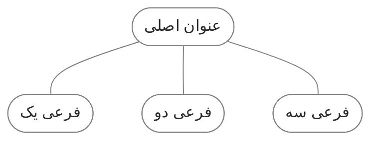

![[cover-quartz.webp]]


در طول استفاده از کوارتز، به مرور زمان تغییرات و اصلاحات مختلفی برای شخصی‌سازی سایت انجام دادم. در این یادداشت فهرستی از این تغییرات رو مستند کردم. من این موارد رو بیشتر به عنوان یک مرجع شخصی دارم، تا موقعی که نیاز باشه بتونم تنظیمات قبلی رو تغییر بدم. همچنین می‌تونه یه راهنمای خوب باشه برای کسانی که میخوان همین تغییرات رو روی سایتشون انجام بدن.

26 اردیبهشت کوارتز رو آپدیت کردم. توی این آپدیت این تغییرات رو بهینه تر کردم. قبلا مستقیما کد های اصلی رو ویرایش کرده بودم. الان اغلب سعی کردم تغییرات رو طوری انجام بدم که کد های اصلی کمترین تغییر رو داشته باشن. اینطوری موقع آپدیت با تضاد های کمتری مواجه میشه.

تغییرات قبلی که مربوط به نسخه 4.2.5 کوارتز بود توی این یادداشت نوشته بودم:

[quartz customization v4.2.5](https://github.com/fardm/quartz/blob/v4/content/quartz%20customization%20v4.2.5.md)

<br> 

## پخش اول: صفحه بندی
چینش محتویات صفحه در فایل [quartz.layout.ts](https://github.com/fardm/quartz/blob/v4/quartz.layout.ts) انجام میشه. چینش رو طوری انجام دادم که برای زبان فارسی راحت تر باشه. یعنی عنوان سایت و فهرست سمت راست. گراف ویو سمت چپ. توی نسخه قبلی کوارتز شکست صفحه از سمت چپ انجام میشد و برای اینکه توی حالت موبایل عنوان سایت به انتهای سایت نره مجبور بودم یه کد اضافه کنم که حهتش معکوس بشه. اما توی آپدیت جدید دیگه نیازی به اینکار نیست. وقتی جهت صفحه رو  RTL بذاری سایدبار ها هم خودشون جا به جا میشن.

برای راستچین شدن هم کافیه کد زیر رو به فایل [renderPage.tsx](https://github.com/fardm/quartz/blob/v4/quartz/components/renderPage.tsx) اضافه کنید. به این شکل:
```tsx title="components/renderPage.tsx"
<html dir="rtl" lang={lang}>
```

دیگه بقیه تنظیمات این فایل سلیقه ایه. من فهرست مطالب رو در حالت موبایل قبل از body قرار دادم. بک لینک رو از سایدبار به afterBody منتقل کردم.

<br><br> 

## بخش دوم: استایل‌ها

### استایل های کلی
خلاصه استایل هایی که توی فایل [custom.scss](https://github.com/fardm/quartz/blob/v4/quartz/styles/custom.scss) اضافه کردم:

1. عنوان footnote: عنوان پخش پاورقی footnote هست که انگلیسیه. از کدی استفاده کردم که فارسی بشه. این ترفند رو [از اینجا](https://blog.eledah.ir/projects/pkm/%D8%A7%D8%B2-%DB%8C%D8%A7%D8%AF%D8%AF%D8%A7%D8%B4%D8%AA-%D8%A8%D9%87-%D8%B3%D8%A7%DB%8C%D8%AA-%D8%A8%D8%A7-%DA%A9%D9%88%D8%A7%D8%B1%D8%AA%D8%B2#%D8%AC%D8%A7%DB%8C%DA%AF%D8%B2%DB%8C%D9%86%DB%8C-footnotes-%D8%A8%D8%A7-%D9%BE%D8%A7%D9%86%D9%88%D8%B4%D8%AA-%D8%AF%D8%B1-%D8%A7%D9%86%D8%AA%D9%87%D8%A7%DB%8C-%D9%85%D8%B7%D8%A7%D9%84%D8%A8) برداشتم.
2. استایل فهرست مطالب رو تغییر دادم. بوردر اضافه کردم. یک خط هم سمت راست تیتر های فرعی اضافه کردم که از تیتر اصلی جدا شه.
3. استایل بک لینک رو تغییر دادم.
4. به عنوان سایت یک تصویر به عنوان آواتار اضافه کردم.
5. بلوک کد: در حالت پیشفرض حتی اگر طول یک سطر کوتاه باشه باز هم اسکرول محور افقی نمایش داده می شود. با اضافه کردن کد `overflow-x: auto` اسکرول تنها در صورتی نمایش داده می‌شود که طول سطر طولانی بوده و خارج از بلوک کد باشد. بقیه تنظیمات مربوط به بک‌گراند، فونت و جهت قرار گفتن متن است.
6. دکمه: یک استایل برای دکمه سفارشی اضافه کردم.
7. تایپوگرافی: مقداری سایز متن بدنه و هدینگ ها را افزایش دادم. همینطور فاصله بین خطوط.

<br> 

### کالوت
برای تغییر رنگ کالوت ها می توانید فایل `quartz/quartz/styles/callouts.scss` رو ویرایش کنید. من قبلا آیکون اختصاصی هم اضافه کرده بودم. اما دیدم باز هم تنوع چندانی نداره. تصمیم گرفتم کالوت هایی بدون آیکون با رنگ های مختلف بسازم. بعد خودم اولش ایموجی اضافه کنم. اینطوری:

> [!empty]+ 👻 شفاف
> لورم ایپسوم متن ساختگی با تولید سادگی نامفهوم از صنعت چاپ.

> [!gray] 💾 خاکستری
> لورم ایپسوم متن ساختگی با تولید سادگی نامفهوم از صنعت چاپ.

> [!yellow]  ⚠️ زرد
> لورم ایپسوم متن ساختگی با تولید سادگی نامفهوم از صنعت چاپ.

> [!orange] 🔥 نارنجی
> لورم ایپسوم متن ساختگی با تولید سادگی نامفهوم از صنعت چاپ.

> [!red] 🚨 قرمز
> لورم ایپسوم متن ساختگی با تولید سادگی نامفهوم از صنعت چاپ.


> [!blue] 🛡️ آبی
> لورم ایپسوم متن ساختگی با تولید سادگی نامفهوم از صنعت چاپ.

> [!green] 🌳 سبز
> لورم ایپسوم متن ساختگی با تولید سادگی نامفهوم از صنعت چاپ.

> [!purple] 🔮 بنفش
> لورم ایپسوم متن ساختگی با تولید سادگی نامفهوم از صنعت چاپ.

> [!brown] 💼 قهوه‌ای
> لورم ایپسوم متن ساختگی با تولید سادگی نامفهوم از صنعت چاپ.

<br> 

یکسری دیگه هم بدون عنوان ایجاد کردم برای زمانی که فقط یک باکس رنگی برای متن نیاز دارم.


> [!empty0] 👻 شفاف
> 👻 لورم ایپسوم متن ساختگی با تولید سادگی نامفهوم از صنعت چاپ.

> [!gray0] 💾 خاکستری
> 💾 لورم ایپسوم متن ساختگی با تولید سادگی نامفهوم از صنعت چاپ.

> [!yellow0]  ⚠️ زرد
> ⚠️ لورم ایپسوم متن ساختگی با تولید سادگی نامفهوم از صنعت چاپ.

> [!orange0] 🔥 نارنجی
> 🔥 لورم ایپسوم متن ساختگی با تولید سادگی نامفهوم از صنعت چاپ.

> [!red0] 🚨 قرمز
> 🚨 لورم ایپسوم متن ساختگی با تولید سادگی نامفهوم از صنعت چاپ.


> [!blue0] 🛡️ آبی
> 🛡️ لورم ایپسوم متن ساختگی با تولید سادگی نامفهوم از صنعت چاپ.

> [!green0] 🌳 سبز
> 🌳 لورم ایپسوم متن ساختگی با تولید سادگی نامفهوم از صنعت چاپ.

> [!purple0] 🔮 بنفش
> 🔮 لورم ایپسوم متن ساختگی با تولید سادگی نامفهوم از صنعت چاپ.

> [!brown0] 💼 قهوه‌ای
> 💼 لورم ایپسوم متن ساختگی با تولید سادگی نامفهوم از صنعت چاپ.


برای اینکه در خود ابسیدین هم این کالوت با آیکون و رنگ اختصاصی نمایش داده شود می توانید از پلاگین Admonition یا Callout Manager استفاده کنید.

<br> 

### چرخش آیکون >
این آیکون در قسمت های مختلف مثل فهرست، اکسپلور و کالوت استفاده شده. جهت این آیکون در حالت بسته باید سمت چپ باشد در حالی که به سمت راست است. برای چرخش آن باید مقدار `rotateZ` را در فایل های مربوط به هر کدام از منفی90 به مثبت90 تغییر دهید.([+](https://blog.eledah.ir/projects/pkm/%D8%A7%D8%B2-%DB%8C%D8%A7%D8%AF%D8%AF%D8%A7%D8%B4%D8%AA-%D8%A8%D9%87-%D8%B3%D8%A7%DB%8C%D8%AA-%D8%A8%D8%A7-%DA%A9%D9%88%D8%A7%D8%B1%D8%AA%D8%B2#%DA%86%D8%B1%D8%AE%D8%A7%D9%86%D8%AF%D9%86-%D9%81%D9%84%D8%B4%D9%87%D8%A7%DB%8C-explorer))

فهرست: `quartz/components/styles/toc.scss`

اکسپلور: `quartz/components/styles/explorer.scss`

کالوت: `quartz/quartz/styles/callouts.scss`

به این شکل:
```scss
  &.collapsed .fold {
    transform: rotateZ(90deg);
  }
```

<br> 

### فوتر
فوتر رو وسط چین کردم. برای لینک ها هم آیکون اضافه کردم. با همون روشی که به لینک های خارجی فاوآیکون اضافه کردم. ([+](https://github.com/fardm/quartz/blob/v4/quartz/styles/_external-links.scss)) متن لینک ها رو هم از فایل [Footer.tsx](https://github.com/fardm/quartz/blob/v4/quartz/components/Footer.tsx) مخفی کردم.

<br> 

### دیاگرام
در کوارتز مانند ابسیدین امکان ساخت دیاگرام وجود داره. به این شکل:



در سایت [mermaid](https://mermaid.js.org/intro/) تمامی دستورات برای استفاده از آن توضیح داده شده. کد زیر دیاگرام بالا را نشان می دهد:
````md

````

تنظیم استایل دیاگرام در خود اون انجام میشه. دو خط آخر کد بالا مربوط به استایل این دیاگرامه. علاوه براین تنظیمات دیگری هم به فایل `custom.scss` اضافه کردم:
- دایرکشن را روی rtl گذاشتم، چون معمولا از فارسی استفاده می کنم.
- بک‌گراند را شفاف کردم، چون بک‌گراند code رو خاکستری کرده بودم، دیاگرام هم خاکستری شده بود.
- فونت را روی body font گذاشتم.
- آیکون «کپی در کلیپ بورد» را مخفی کردم.

```scss title="custom.scss"
.mermaid {
	direction: rtl !important;
}

pre:has(>code.mermaid) {
	background-color: transparent;
	.clipboard-button {
		display: none;
	}
	svg {
		margin: auto;
	}
}

.nodeLabel {
	font-family: var(--bodyFont);
}

```

<br> 

### فاوآیکون لینک‌های خارجی

به بعضی از لینک های خارجی فاوآیکون اضافه کردم:

> [!empty]- 🔗 نمونه لینک‌ها
> 
> [normal](https://quantumgardener.info)
> 
> [github](https://github.com)
> 
> [twitter](https://twitter.com)
> 
> [google](https://www.google.com)
> 
> [youtube](https://www.youtube.com)
> 
> [aparat](https://www.aparat.com/v/zbg2jw5)
> 
> [motamem](https://motamem.org/)
> 
> 
> 
> [لینک عادی](https://quantumgardener.info)
> 
> [گیت هاب](https://github.com)
> 
> [توییتر](https://twitter.com/)
> 
> [گوگل](https://www.google.com)
> 
> [یوتیوب](https://www.youtube.com)
> 
> [آپارات](https://www.aparat.com/)
> 
> [متمم](https://motamem.org/)


اول  فایل [external-links.scss](https://github.com/fardm/quartz/blob/v4/quartz/styles/_external-links.scss) رو به پوشه quartz\styles اضافه کنید. بعد این کد رو به ابتدای فایل `custom.scss` اضافه کنید:

```scss
@use "./_external-links.scss";
```

این ایده رو توی سایت [quartz.eilleeenz.com](https://quartz.eilleeenz.com/) دیدم و کدها رو از [اینجا](https://github.com/CatCodeMe/catcodeme.github.io/blob/770f3f8d1f6849ef40bc06b4300a52b3aecfb551/quartz/styles/external-links.scss) برداشتم.

<br> 

### نمای کارتی
این تنظیم استایل جدول رو به حالت کارت تبدیل می‌کنه. مشابه حالتی که [تم minimal](https://minimal.guide/cards) برای جدول‌های dataview می‌سازه. یک حالت دیگه هم اضافه کردم که باعث میشه کارت‌ها فقط در یک ردیف نمایش داده بشن و بقیه کارت‌ها با اسکرول کردن قابل مشاهده باشن. برای زمانی که تعداد کارت‌ها زیاد باشه این روش مناسب تره.

برای استفاده از این روش اول فایل زیر رو دانلود و در مسیر `quartz/styles` قرار بدید:

[card-view](https://github.com/fardm/quartz/blob/v4/quartz/styles/_card-view.scss)

بعد کد زیر رو به ابتدای فایل `custom.scs` اضافه کنید.
```scss
@use "./_card-view.scss";
```

حالا می تونید از دو روش برای اعمال این استایل روی فایل‌هاتون استفاده کنید:

1️⃣ اگر میخواهید روی همه جدول‌های موجود در یادداشت اعمال بشن یک پراپرتی با عنوان `cssclasses` به یادداشت تون اضافه کنید بعد کلاس دلخواه رو وارد کنید. به این شکل:
```md
---
cssclasses: card-g c-3
---
```

2️⃣ اگر نمی خواهید این استایل روی همه جدول‌ها اعمال بشه می تونید جدول تون رو در تگ div بذارید و کلاس مورد نظر رو براش تعریف کنید. به این شکل:
```html
<div class="card-g c-2">
| class  | description  |
| ------ | ------------ |
| card-g | grid style   |
| card-s | scroll style |
</div>
```

<br>
راهنمای کامل کلاس ها رو اینجا می تونید ببینید:

> [!gray]- 📝 راهنمای کلاس‌ها
> **کلاس های مربوط به حالت گرید** 
> |   |                             |
> | ------ | -------------------------------------- |
> | card-g | یک نمای کارتی با 4 ستون در ردیف‌های متعدد می‌سازد |
> | c-2    | نمایش کارت ها در 2 ستون                |
> | c-3    | نمایش کارت ها در 3 ستون                |
> | c-5    | نمایش کارت ها در 5 ستون                |
> | c-6    | نمایش کارت ها در 6 ستون                |
> 
> ![[Pasted image 20240824171442.jpg|400]]
> 
> <br>
> 
> ---
> 
> **کلاس های مربوط به حالت اسکرول**
> |   |                          |
> | ------ | ----------------------------------- |
> | card-s | یک نمای کارتی با عرض 150px در یک ردیف میسازد |
> | w100   | تنظیم عرض کارت روی 100px            |
> | w200   | تنظیم عرض کارت روی 200px            |
> | w300   | تنظیم عرض کارت روی 300px            |
> 
> ![[Pasted image 20240824171737.jpg|400]]
> <br>
> 
> ---
> 
> **کلاس های مشترک**
> |   |                          |
> | ------ | ----------------------------------- |
> | nowarp    | متن را در یک خط نگه داشته و کاراکتر های اضافی را مخفی می‌کند                |
> | nowarp2    | متن را در دو خط نگه داشته و کاراکتر های اضافی را مخفی می‌کند                |
> | c1-1    | نسبت تصویر را 1:1 تنظیم می‌کند                |
> | c16-1    | نسبت تصویر را 16:9 تنظیم می‌کند                |
> 
> ![[calsshelp.jpg|400]]
> 
> ---
> 
> 💡این کلاس‌ها رو میتویند با هم ترکیب کنید. مثلا من میخوام از حالت گرید استفاده کنم که 3 تا ستون داشته باشه، نسبت تصویر 1:1 باشه و متن هم در دو خط نگه داره. استایل هایی که باید استفاده کنم به این شکله:
> ```md
> ---
> cssclasses:
>   - card-g
>   - c-3
>   - c1-1
>   - nowarp2
> ---
> ```


<br><br> 
### گالری تصاویر
وقتی از چندتا تصویر استفاده میکنم یک گرید اضافه کردم که کنار هم قرار بگیرند. اینطوری:

![[SketchStrategy2.webp]] 
![[How-to-Be-Everything-sketch.webp]]

![[sketchnotes-greta-thunberg-ted-talk.webp]] ![[leistungen-nadinerossa-graphicrecording.webp]] ![[ben-james-sketchnote-1.webp]]

<br> 

برای اینکار از این کد استفاده کردم:
```scss title="custom.scss"
.img-grid img {
	object-fit: cover;
	margin: 0 auto;
}

.img-grid p:has(img) {
display: grid;
margin-block: 0.5rem;
grid-column-gap: 0.5rem;
grid-template-columns: repeat(auto-fit, minmax(0, 1fr));
align-items: stretch;
}
```

بعد از وارد کردن کد کافیه از کلاس `img-grid` توی پراپرتی cssclases هر یادداشت استفاده کنید تا این گرید روی تصاویر یادداشت اعمال بشه. بین تصاویر هم یا اسپیس بزنید یا فقط یک اینتر بزنید به این شکل:
```md title="example.md"
---
cssclasses:
  - img-grid
---

✅ با اسپیس
![[image1.jpg]] ![[image1.jpg]]

✅ با اینتر
![[image1.jpg]]
![[image1.jpg]]

❌ اگر اینطوری اینتر بزنید گرید ساخته نمیشه و هر تصویر یک سطر رو اشغال میکنه:
![[image1.jpg]]

![[image1.jpg]]

```

<br><br>

## بخش سوم: امکانات
### دکمه‌های شناور
یک مورد جذاب هم در فوتر [quartz.eilleeenz.com](https://quartz.eilleeenz.com) دیدم که با کلیک کردن روی Random Page یک صفحه تصادفی به کاربر نمایش میده. یک دکمه اسکرول به بالا هم داره. اخیرا این دو مورد رو به صورت دکمه شناور گوشه پایین سایت قرار داده. [از اینجا ](https://quartz.eilleeenz.com/Quartz-customization-log#random-page)می تونید توضیحات خودش رو مشاهده کنید. 

برای اضافه کردنش باید یک کامپوننت جدید بسازیم و استایل و اسکریپتش رو بهش اضافه کنیم. برای این کار کافیه فایل های زیر رو به کوارتز اضافه کنیم. دقیقا در همین مسیری که این فایل ها قرار دارند:

- [FloatingButtons.tsx](https://github.com/fardm/quartz/blob/v4/quartz/components/_FloatingButtons.tsx)
- [floatingButtons.inline.ts](https://github.com/fardm/quartz/blob/v4/quartz/components/scripts/_floatingButtons.inline.ts)
- [floatingButtons.scss](https://github.com/fardm/quartz/blob/v4/quartz/components/styles/_floatingButtons.scss)

بعد باید این کامپوننت رو به فایل [Index.ts](https://github.com/fardm/quartz/blob/v4/quartz/components/index.ts) اضافه کنیم:

```ts title="components/index.ts"
import FloatingButtons from "./_FloatingButtons"
...
  FloatingButtons,

```

حالا میتونیم این کامپوننت رو در فایل [quartz.layout.ts](https://github.com/fardm/quartz/blob/v4/quartz.layout.ts) استفاده کنیم. به این شکل:

```ts title="quartz.layout.ts"
right: [
    Component.FloatingButtons(),
  ],
```

<br> 

### کانتنت متا
بخش کانتنت متا که تاریخ و مدت زمان مطالعه رو نشون میده تغییر دادم. در حالت پیشفرض فقط یک تاریخ رو نشون میده که نهایتا میتونید روی تاریخ انتشار یا تاریخ آخرین به‌روزرسانی تنظیمش کنید. من تمایل داشتم علاوه بر تاریخ انتشار، تاریخ آخرین به‌روزرسانی هم برای کاربر قابل مشاهده باشه. 

یه مورد دیگه هم نیاز داشتم که وضعیت رشد یادداشت رو نشون بده. طبق روش [[digital garden|دیجیتال گاردن]] از `🌱نهال`، `🪴درختچه`، `🌳همیشه‌سبز` و `🍂زودگذر` باید برای مشخص کردن وضعیت یادداشت استفاده کرد.

برای اینکه بتونیم این موارد رو داشته باشیم باید یک کامپوننت جدید بسازیم. کافیه فایل های زیر رو به کوارتز اضافه کنیم. دقیقا در همین مسیری که این فایل ها قرار دارند:
- [Properties.tsx](https://github.com/fardm/quartz/blob/v4/quartz/components/_Properties.tsx)
- [Properties.scss](https://github.com/fardm/quartz/blob/v4/quartz/components/styles/_Properties.scss)

بعد باید این کامپوننت رو به فایل [Index.ts](https://github.com/fardm/quartz/blob/v4/quartz/components/index.ts) معرفی کنیم. به این شکل:

```ts title="components/index.ts"
import Properties from "./_Properties"
...
  Properties,

```

حالا میتونیم این کامپوننت رو در فایل [quartz.layout.ts](https://github.com/fardm/quartz/blob/v4/quartz.layout.ts) استفاده کنیم. به این شکل:

```ts title="quartz.layout.ts"
beforeBody: [
    Component.ConditionalRender({
      component: Component.Properties({ showReadingTime: false, showComma: false }),
      condition: (page) => page.fileData.slug !== "index",
    }),
  ],
```

(این یک مورد شرطی هست که این کامپوننت رو در همه صفحات نمایش میده به جز صفحه index. این رو اضافه کردم چون معمولا توی این صفحه این موارد نباشه بهتره. من مدت زمان مطالعه رو غیر فعال کردم. همینطور ویرگولی که بین اینها قرار میگرفت.)

حالا از پراپرتی های زیر میتونید توی یادداشت تون استفاده کنید:

```md title="example.md"
---
date: 2025-05-01
lastmod: 2025-06-30
status: 🌱نهال
---

```
