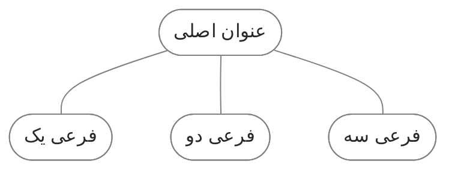

![[quartz-customization.webp]]


در طول استفاده از کوارتز، به مرور زمان تغییرات و اصلاحات مختلفی رو برای شخصی‌سازی سایت انجام دادم. اینجا فهرستی از این تغییرات رو ثبت کردم. این موارد رو بیشتر به عنوان یک مرجع شخصی درست کردم، تا اگر خواستم تنظیمات رو تغییر بدم بهش مراجعه کنم. 

البته اگر شما هم میخوایید سایت تون رو شخصی سازی کنید میتونید از این تنظیمات استفاده کنید.

<br> 

> [!blue]- 🚀 آپدیت به ورژن 4.5.0
> نسخه قبلی کوارتز من 4.2.5 بود. 26 اردیبهشت به ورژن 4.5.0 آپدیتش کردم. توی این آپدیت تنظیمات سفارشی خودم رو بهینه تر کردم. قبلا مستقیما کد های اصلی رو ویرایش کرده بودم. الان اغلب سعی کردم تغییرات رو طوری انجام بدم که کد های اصلی کمترین تغییر رو داشته باشن. اینطوری موقع آپدیت با تضاد های کمتری مواجه میشه.
> 
> تغییرات قبلی که مربوط به نسخه 4.2.5 کوارتز بود رو [اینجا](https://github.com/fardm/ifard-blog/blob/v4/content/quartz-customization-v4.2.5.md) نوشته بودم.

<br> 

## بخش اول: رابط کاربری
قبل از هر چیز باید جهت صفحه رو راستچین (RTL)  کنیم تا برای فارسی مناسب باشه. برای اینکار باید فایل [renderPage.tsx](https://github.com/fardm/ifard-blog/blob/c8c6b731f80643f35555420870b7a7d8cf543d97/quartz/components/renderPage.tsx#L235C5-L235C33) رو ویرایش کنید. به این شکل:

```tsx title="components/renderPage.tsx"
<html dir="rtl" lang={lang}>
```

<br> 

چینش محتویات صفحه در فایل [quartz.layout.ts](https://github.com/fardm/ifard-blog/blob/v4/quartz.layout.ts) انجام میشه. من اینطوری تنظیمش کردم:
- هدر: پیج تایتل، جستجو، دارک مود
- سایدبار چپ: گراف ویو
- سایدبار راست: فهرست مطالب
- افتربادی: بک لینک، تگ لیست، کامنت

یک استایل خاص هم برای عنصر های اصلی در نظر گرفتم:
- هدر رو به حالت navbar تبدیل کردم. 
- به title page یک تصویر اضافه کردم به عنوان لوگوی سایت.
- بک گراند رو خاکستری کردم و به المان های اصلی(بادی، سایدبار و فوتر) بوردر و بک گراند سفید دادم که متمایز باشه.
- توی فهرست مطالب یک خط سمت راست تیتر های فرعی اضافه کردم که از تیتر اصلی جدا شه.
- به لینک های فوتر آیکون اضافه کردم. متن لینک ها رو هم از فایل [Footer.tsx](https://github.com/fardm/ifard-blog/blob/v4/quartz/components/Footer.tsx) مخفی کردم.

<br> 

برای اینکه این استایل بهتر روی کار بشینه مجبور شدم فایل [renderPage.tsx](https://github.com/fardm/ifard-blog/blob/c8c6b731f80643f35555420870b7a7d8cf543d97/quartz/components/renderPage.tsx#L235C5-L235C33) رو ویرایش کنم و یک تگ والد به عنصر page-header و popover-hint اضافه کنم. چون تفکیک این دوتا جالب نمیشد و باید توی یک بخش قرار می‌گرفتند.

از طرف دیگه نمیخواستم کل المان های موجود در عنصر center ( یعنی متن یادداشت، بک لینک، تگ لیست و کامنت) توی یک بخش قرار بگیرند.  میخواستم از هم تفکیک بشه. به خاطر همین لازم بود یک تگ والد برای اونا درنظر بگیرم تا بتونم با هم دیگه سلکتشون کنم و بهشون استایل بدم.


<br> 

اگر میخوایید از این صفحه بندی و استایل استفاده کنید این مراحل رو انجام بدید:
1. طبق فایل [quartz.layout.ts](https://github.com/fardm/ifard-blog/blob/v4/quartz.layout.ts) المان ها رو بچینید. (یا اینکه این فایل را دانلود کرده و جایگزین فایل خودتان کنید)
2. فایل [renderPage.tsx](https://github.com/fardm/ifard-blog/blob/c8c6b731f80643f35555420870b7a7d8cf543d97/quartz/components/renderPage.tsx#L235C5-L235C33) رو دانلود کنید و جایگزین فایل خود در مسیر quartz/components کنید. (یا طبق فایل یک تگ div والد با کلاس page-top اضافه کنید)
3. فایل [ui.scss](https://github.com/fardm/ifard-blog/blob/v4/quartz/styles/_ui.scss) رو دانلود کنید و توی مسیر quartz/styles قرار بدید.
4. این کد رو به فایل [custom.scss](https://github.com/fardm/ifard-blog/blob/v4/quartz/styles/custom.scss) اضافه کنید:
```scss title="custom.scss"
@use "./_ui.scss";

// Colors
    :root {
        --bg: #ffffff;
      }
  
    [saved-theme="dark"] {
        --bg: #1a222e;
    }

```

5. برای لوگوی سایت، فایل تصویر خودتون رو با اسم avatar.webp ذخیره کرده و توی مسیر quartz/static قرار بدید.
<br><br> 

## بخش دوم: استایل‌ها

### استایل های کلی
خلاصه استایل هایی که توی فایل [custom.scss](https://github.com/fardm/ifard-blog/blob/v4/quartz/styles/custom.scss) اضافه کردم:

1. عنوان footnote: عنوان پخش پاورقی footnote هست که انگلیسیه. از کدی استفاده کردم که فارسی بشه. این ترفند رو [از بلاگ کریستالین](https://blog.eledah.ir/projects/pkm/%D8%A7%D8%B2-%DB%8C%D8%A7%D8%AF%D8%AF%D8%A7%D8%B4%D8%AA-%D8%A8%D9%87-%D8%B3%D8%A7%DB%8C%D8%AA-%D8%A8%D8%A7-%DA%A9%D9%88%D8%A7%D8%B1%D8%AA%D8%B2#%D8%AC%D8%A7%DB%8C%DA%AF%D8%B2%DB%8C%D9%86%DB%8C-footnotes-%D8%A8%D8%A7-%D9%BE%D8%A7%D9%86%D9%88%D8%B4%D8%AA-%D8%AF%D8%B1-%D8%A7%D9%86%D8%AA%D9%87%D8%A7%DB%8C-%D9%85%D8%B7%D8%A7%D9%84%D8%A8) برداشتم.
2. بلوک کد: در حالت پیشفرض حتی اگر طول یک سطر کوتاه باشه باز هم اسکرول محور افقی نمایش داده می شود. با اضافه کردن کد `overflow-x: auto` اسکرول تنها در صورتی نمایش داده می‌شود که طول سطر طولانی بوده و خارج از بلوک کد باشد. بقیه تنظیمات مربوط به بک‌گراند، فونت و جهت قرار گفتن متن است.
3. تایپوگرافی: مقداری سایز متن بدنه و هدینگ ها را افزایش دادم. همینطور فاصله بین خطوط.

<br> 

### ‌کال‌اوت
برای تغییر رنگ ‌کال‌اوت ها می تونید فایل `quartz/quartz/styles/callouts.scss` رو ویرایش کنید. من قبلا آیکون اختصاصی هم اضافه کرده بودم اما تنوع چندانی نداشت. تصمیم گرفتم ‌کال‌اوت هایی بدون آیکون با رنگ های مختلف بسازم. بعد اولش ایموجی اضافه کنم. اینطوری:

> [!empty]+ 👻 شفاف
> لورم ایپسوم متن ساختگی با تولید سادگی نامفهوم از صنعت چاپ.

> [!gray] 💾 خاکستری
> لورم ایپسوم متن ساختگی با تولید سادگی نامفهوم از صنعت چاپ.

> [!yellow]  ⚠️ زرد
> لورم ایپسوم متن ساختگی با تولید سادگی نامفهوم از صنعت چاپ.

> [!orange] 🔥 نارنجی
> لورم ایپسوم متن ساختگی با تولید سادگی نامفهوم از صنعت چاپ.

> [!red] 🚨 قرمز
> لورم ایپسوم متن ساختگی با تولید سادگی نامفهوم از صنعت چاپ.


> [!blue] 🛡️ آبی
> لورم ایپسوم متن ساختگی با تولید سادگی نامفهوم از صنعت چاپ.

> [!green] 🌳 سبز
> لورم ایپسوم متن ساختگی با تولید سادگی نامفهوم از صنعت چاپ.

> [!purple] 🔮 بنفش
> لورم ایپسوم متن ساختگی با تولید سادگی نامفهوم از صنعت چاپ.

> [!brown] 💼 قهوه‌ای
> لورم ایپسوم متن ساختگی با تولید سادگی نامفهوم از صنعت چاپ.

<br> 

یکسری دیگه هم بدون عنوان ایجاد کردم برای زمانی که فقط یک باکس رنگی برای متن نیاز دارم.


> [!empty0] 👻 شفاف
> 👻 لورم ایپسوم متن ساختگی با تولید سادگی نامفهوم از صنعت چاپ.

> [!gray0] 💾 خاکستری
> 💾 لورم ایپسوم متن ساختگی با تولید سادگی نامفهوم از صنعت چاپ.

> [!yellow0]  ⚠️ زرد
> ⚠️ لورم ایپسوم متن ساختگی با تولید سادگی نامفهوم از صنعت چاپ.

> [!orange0] 🔥 نارنجی
> 🔥 لورم ایپسوم متن ساختگی با تولید سادگی نامفهوم از صنعت چاپ.

> [!red0] 🚨 قرمز
> 🚨 لورم ایپسوم متن ساختگی با تولید سادگی نامفهوم از صنعت چاپ.


> [!blue0] 🛡️ آبی
> 🛡️ لورم ایپسوم متن ساختگی با تولید سادگی نامفهوم از صنعت چاپ.

> [!green0] 🌳 سبز
> 🌳 لورم ایپسوم متن ساختگی با تولید سادگی نامفهوم از صنعت چاپ.

> [!purple0] 🔮 بنفش
> 🔮 لورم ایپسوم متن ساختگی با تولید سادگی نامفهوم از صنعت چاپ.

> [!brown0] 💼 قهوه‌ای
> 💼 لورم ایپسوم متن ساختگی با تولید سادگی نامفهوم از صنعت چاپ.

<br> 

یک ‌کال‌اوت هم اضافه کردم برای شعر که متن وسط چین باشه:

> [!poem] Title
> منشین چنین زار و حزین چون روی زردان <br> 
>  شعری بخوان سـازی بزن جامی بـــگردان
>  
> 
> `هوشنگ ابتهاج`

<br> 

برای استفاده از این استایل میتونید کدی که به فایل [callouts.scss](https://github.com/fardm/ifard-blog/blob/v4/quartz/styles/callouts.scss) اضافه کردم رو کپی کنید و توی فایل خودتون قرار بدید.


برای اینکه توی خود ابسیدین هم این ‌کال‌اوت با آیکون و رنگ اختصاصی نمایش داده بشه می تونید از پلاگین Admonition یا Callout Manager استفاده کنید.

<br> 

### چرخش آیکون >
این آیکون در قسمت های مختلف مثل فهرست، اکسپلور و ‌کال‌اوت استفاده شده. جهت این آیکون در حالت بسته باید سمت چپ باشد در حالی که به سمت راست است. برای چرخش آن باید مقدار `rotateZ` را در فایل های مربوط به هر کدام از منفی90 به مثبت90 تغییر دهید.([+](https://blog.eledah.ir/projects/pkm/%D8%A7%D8%B2-%DB%8C%D8%A7%D8%AF%D8%AF%D8%A7%D8%B4%D8%AA-%D8%A8%D9%87-%D8%B3%D8%A7%DB%8C%D8%AA-%D8%A8%D8%A7-%DA%A9%D9%88%D8%A7%D8%B1%D8%AA%D8%B2#%DA%86%D8%B1%D8%AE%D8%A7%D9%86%D8%AF%D9%86-%D9%81%D9%84%D8%B4%D9%87%D8%A7%DB%8C-explorer))

فهرست: `quartz/components/styles/toc.scss`

اکسپلور: `quartz/components/styles/explorer.scss`

‌کال‌اوت: `quartz/quartz/styles/callouts.scss`

به این شکل:
```scss
  &.collapsed .fold {
    transform: rotateZ(90deg);
  }
```

<br> 

### دیاگرام
در کوارتز مثل ابسیدین امکان ساخت دیاگرام وجود داره. به این شکل:



در سایت [mermaid](https://mermaid.js.org/intro/) تمامی دستورات برای استفاده از آن توضیح داده شده. کد زیر دیاگرام بالا را نشان می دهد:
````md

````

تنظیم استایل دیاگرام در خود اون انجام میشه. دو خط آخر کد بالا مربوط به استایل این دیاگرامه. علاوه براین تنظیمات دیگری هم به فایل `custom.scss` اضافه کردم:
- دایرکشن را روی rtl گذاشتم، چون معمولا از فارسی استفاده می کنم.
- بک‌گراند را شفاف کردم، چون بک‌گراند code رو خاکستری کرده بودم، دیاگرام هم خاکستری شده بود.
- فونت را روی body font گذاشتم.
- آیکون «کپی در کلیپ بورد» را مخفی کردم.

```scss title="custom.scss"
.mermaid {
	direction: rtl !important;
}

pre:has(>code.mermaid) {
	background-color: transparent;
	.clipboard-button {
		display: none;
	}
	svg {
		margin: auto;
	}
}

.nodeLabel {
	font-family: var(--bodyFont);
}

```

<br> 

### نمای کارتی
از نمای کارتی دو جا استفاده میکنم. یکی برای گزارش‌ها یکی هم برای لینک‌دهی به یادداشت‌ها.
#### نمای کارتی نوشته‌ها
ایده این رو از سایت [کریستالین](https://blog.eledah.ir/) گرفتم. خروجی‌اش اینه:

```cardnote
{
  "title": "بررسی ابسیدین",
  "image": "/assets/images/obsidian-in-hand.webp",
  "link": "./obsidian-review"
}
{
  "title": "ساخت هبیت ترکر در ابسیدین",
  "image": "/assets/images/habit-tracker.webp",
  "link": "./habit-tracker-in-obsidian"
}
```

برای اضافه کردنش این مراحل رو انجام بدید:
1. پلاگین [cardnote.ts](https://github.com/fardm/ifard-blog/blob/v4/quartz/plugins/transformers/__cardnote.ts) رو به مسیر quartz/plugins/transformers اضافه کنید.
2. توی فایل `index.ts`ایمپورتش کنید.
```ts title="quartz/plugins/transformers/index.ts"
export { CardNote } from "./_cardnote"
```
3. توی فایل `quartz.config.ts` اضافه اش کنید.
```ts
  plugins: {
    transformers: [
    //بقیه پلاگین ها
      Plugin.CardNote(),
```
4. فایل [card-view](https://github.com/fardm/ifard-blog/blob/v4/quartz/styles/_card-view.scss) رو دانلود کرده  و در مسیر `quartz/styles` قرار بدید.
5. کد زیر رو به ابتدای فایل `custom.scs` اضافه کنید.
```scss
@use "./_card-view.scss";
```

5. حالا توی یادداشت تون از این سینتکس استفاده کنید:
````
```cardnote
{
  "title": "بررسی ابسیدین",
  "image": "/assets/images/obsidian-review.webp",
  "link": "./obsidian-review"
}
{
  "title": "ساخت هبیت ترکر در ابسیدین",
  "image": "/assets/images/1755378027311.webp",
  "link": "./habit-tracker-in-obsidian"
}
```
````

هر موردی که اضافه کنید یه کارت میسازه و به تعداد هر مورد یک ستون اضافه میشه. 

یه قابلیتی هم هست برای اینکه ستون اضافه بشه اما کارتی نمایش نده. مثلا سینتکس زیر فقط یک کارت میسازه اما دو ستونه است و کارت اول فقط به اندازه یک ستون فضا میگیره:
````
```cardnote
{
  "title": "بررسی ابسیدین",
  "image": "/assets/images/obsidian-in-hand.webp",
  "link": "./obsidian-review"
}
{  
"empty": true  
}
```
````

خروجی:
```cardnote
{
  "title": "بررسی ابسیدین",
  "image": "/assets/images/obsidian-in-hand.webp",
  "link": "./obsidian-review"
}
{  
"empty": true  
}
```

<br>

### نمای کارتی جدول‌ها
این استایل جدول رو به حالت کارت تبدیل می‌کنه. مشابه حالتی که [تم minimal](https://minimal.guide/cards) برای جدول‌های dataview می‌سازه. یک حالت دیگه هم اضافه کردم که باعث میشه کارت‌ها فقط در یک ردیف نمایش داده بشن و بقیه کارت‌ها با اسکرول کردن قابل مشاهده باشن. برای زمانی که تعداد کارت‌ها زیاد باشه این روش مناسب تره.

این مورد فقط استایل هست و نیاز به پلاگین نداره. برای اضافه کردن کافیه مثل مورد قبل فایل [card-view](https://github.com/fardm/ifard-blog/blob/v4/quartz/styles/_card-view.scss) رو در مسیر `quartz/styles` قرار بدید. بعد کد زیر رو به ابتدای فایل `custom.scs` اضافه کنید.
```scss
@use "./_card-view.scss";
```

تمام!

حالا می تونید از دو روش برای اعمال این استایل روی فایل‌هاتون استفاده کنید:

۱. اگر میخواهید روی همه جدول‌های موجود در یادداشت اعمال بشن یک پراپرتی با عنوان `cssclasses` به یادداشت تون اضافه کنید بعد کلاس دلخواه رو وارد کنید. به این شکل:
```md
---
cssclasses: card-g c-3
---
```

۲. اگر نمی خواهید این استایل روی همه جدول‌ها اعمال بشه می تونید جدول تون رو در تگ div بذارید و کلاس مورد نظر رو براش تعریف کنید. به این شکل:
```html
<div class="card-g c-2">
| class  | description  |
| ------ | ------------ |
| card-g | grid style   |
| card-s | scroll style |
</div>
```

<br>

> [!gray]- 📝 راهنمای کامل کلاس‌ها
> **کلاس های مربوط به حالت گرید** 
> |   |                             |
> | ------ | -------------------------------------- |
> | card-g | یک نمای کارتی با 4 ستون در ردیف‌های متعدد می‌سازد |
> | c-2    | نمایش کارت ها در 2 ستون                |
> | c-3    | نمایش کارت ها در 3 ستون                |
> | c-5    | نمایش کارت ها در 5 ستون                |
> | c-6    | نمایش کارت ها در 6 ستون                |
> 
> ![[Pasted image 20240824171442.jpg|400]]
> 
> <br>
> 
> ---
> 
> **کلاس های مربوط به حالت اسکرول**
> |   |                          |
> | ------ | ----------------------------------- |
> | card-s | یک نمای کارتی با عرض 150px در یک ردیف میسازد |
> | w100   | تنظیم عرض کارت روی 100px            |
> | w200   | تنظیم عرض کارت روی 200px            |
> | w300   | تنظیم عرض کارت روی 300px            |
> 
> ![[Pasted image 20240824171737.jpg|400]]
> <br>
> 
> ---
> 
> **کلاس های مشترک**
> |   |                          |
> | ------ | ----------------------------------- |
> | nowarp    | متن را در یک خط نگه داشته و کاراکتر های اضافی را مخفی می‌کند                |
> | nowarp2    | متن را در دو خط نگه داشته و کاراکتر های اضافی را مخفی می‌کند                |
> | c1-1    | نسبت تصویر را 1:1 تنظیم می‌کند                |
> | c16-1    | نسبت تصویر را 16:9 تنظیم می‌کند                |
> | c3-4    | نسبت تصویر را 3:4 تنظیم می‌کند                |
> 
> ![[calsshelp.jpg|400]]
> 
> ---
> 
> 💡این کلاس‌ها رو میتویند با هم ترکیب کنید. مثلا من میخوام از حالت گرید استفاده کنم که 3 تا ستون داشته باشه، نسبت تصویر 1:1 باشه و متن هم در دو خط نگه داره. استایل هایی که باید استفاده کنم به این شکله:
> ```md
> ---
> cssclasses:
>   - card-g
>   - c-3
>   - c1-1
>   - nowarp2
> ---
> ```

<br><br>

## بخش سوم: امکانات
### دکمه‌های شناور
یک مورد جذاب در فوتر [quartz.eilleeenz.com](https://quartz.eilleeenz.com) دیدم که با کلیک کردن روی Random Page یک صفحه تصادفی به کاربر نمایش میده. یک دکمه اسکرول به بالا هم داره. اخیرا این دو مورد رو به صورت دکمه شناور گوشه پایین سایت قرار داده. [از اینجا ](https://quartz.eilleeenz.com/Quartz-customization-log#random-page)می تونید توضیحات خودش رو مشاهده کنید. 

برای اضافه کردنش باید یک کامپوننت جدید بسازیم و استایل و اسکریپتش رو بهش اضافه کنیم. برای این کار کافیه فایل های زیر رو به کوارتز اضافه کنیم. دقیقا در همین مسیری که این فایل ها قرار دارند:

- [FloatingButtons.tsx](https://github.com/fardm/ifard-blog/blob/v4/quartz/components/_FloatingButtons.tsx)
- [floatingButtons.inline.ts](https://github.com/fardm/ifard-blog/blob/v4/quartz/components/scripts/_floatingButtons.inline.ts)
- [floatingButtons.scss](https://github.com/fardm/ifard-blog/blob/v4/quartz/components/styles/_floatingButtons.scss)

بعد باید این کامپوننت رو به فایل [Index.ts](https://github.com/fardm/ifard-blog/blob/v4/quartz/components/index.ts) اضافه کنیم:

```ts title="components/index.ts"
import FloatingButtons from "./_FloatingButtons"
...
  FloatingButtons,

```

حالا میتونیم این کامپوننت رو در فایل [quartz.layout.ts](https://github.com/fardm/ifard-blog/blob/v4/quartz.layout.ts) استفاده کنیم. به این شکل:

```ts title="quartz.layout.ts"
right: [
    Component.FloatingButtons(),
  ],
```

<br><br>

### تصاویر
#### لایت باکس تصاویر
توی سایت ها معمولا وقتی کاربر روی تصویر کلیک کنه یک لایت باکس باز میشه و تصویر رو با ابعاد بزرگ تر نمایش میده. کوارتز به صورت پیشفرض این قابلیت رو نداره.

یکی از کاربران یک پلاگین نوشته و این قابلیت رو برای کوراتز فراهم کرده. توضیحات کامل و فایل مورد نیاز توی لینک زیر هست:

[Quartz Clickable Images Zoom plugin](https://github.com/vazome/quartz-clickable-images-zoom-plugin)

<br> 

#### کاروسل تصاویر
این هم یکی دیگه از قابلیت هایی بود که کوارتز کم داشت. کاروسل تصاویر به این شکل میشه:

<Carousel>


</Carousel>

توضیحات کامل و فایل ها توی لینک زیر هست:

[A Carousel component for Quartz v4.5](https://gist.github.com/pinei/14545e81e8629eed72b55fce1cbd7822)


> [!yellow]  ⚠️ مشکل نمایش اسلایدهای بعدی
> اگر مثل من جهت سایت رو راستچین کرده باشید یعنی طبق تنظیماتی که [[quartz-customization#بخش اول صفحه بندی|اینجا]] گفتم دایرکشن rtl باشه، فقط اسلاید اول رو بهتون نشون میده و بقیه اسلاید ها رو نمایش نمیده. برای حل این مشکل باید فایل [carousel.inline.scss](https://github.com/fardm/ifard-blog/blob/v4/quartz/components/scripts/_carousel.inline.ts) رو ادیت کنید.
> 
> با اضافه کردن استایل زیر این مشکل حل میشه:
> ```scss title="carousel.inline.scss" showLineNumbers{8}
> article .quartz-carousel {
>   direction: ltr; // این خط رو اضافه کنید
>   }
> ```
> 
> علاوه بر این یه مشکل دیگه هم هست. چون مسیریابی سایت به صورت پیش‌فرض SPA هست، وقتی کاربر روی جهت ها کلیک میکنه تا اسلاید بعدی رو ببینه اتفاقی نمیفته چون اسکریپت لود نشده. من کمی کدش رو اصلاح کردم تا این مشکل رو نداشته باشه. میتونید از فایل من استفاده کنید:
> 
> [carousel.inline.scss](https://github.com/fardm/ifard-blog/blob/v4/quartz/components/scripts/_carousel.inline.ts)


<br> 


#### گالری تصاویر (Grid)
وقتی از چندتا تصویر استفاده میکنم یک گرید اضافه کردم که کنار هم قرار بگیرند. اینطوری:

<div class="img-grid">
  
  
  
</div>

<br> 

برای اینکار اول کد زیر رو به فایل custom.scss اضافه کنید:

اگر لایت باکس رو فعال کردید این رو استفاده کنید:
```scss title="custom.scss"
.img-grid {
	display: grid;
	margin-block: 0.5rem;
	grid-column-gap: 0.5rem;
	grid-template-columns: repeat(auto-fit, minmax(0, 1fr));
	align-items: stretch;
}

.img-grid .lightbox-wrapper {
	height: 100%;
	display: flex;
	justify-content: center;
	align-items: center;
}

.img-grid .lightbox-wrapper .lightbox-image {
	width: 100%;
	height: 100%;
	object-fit: cover;
	margin: 0;
}
```

اگر لایت باکس رو فعال نکردید این رو استفاده کنید:
```scss title="custom.scss"
.img-grid {
	display: grid;
	margin-block: 0.5rem;
	grid-column-gap: 0.5rem;
	grid-template-columns: repeat(auto-fit, minmax(0, 1fr));
	align-items: stretch;
}

.img-grid img {
	object-fit: cover;
	margin: 0 auto;
}
```


بعد به این شکل از تصاویر داخل فایل مارکدان استفاده کنید:
```html
<div class="img-grid">
  
  
  
</div>
```

اسم فایل تون رو جایگزین `image1.jpg` کنید.

اینطوری هم میتونید بهش کپشن اضافه کنید:
```html
<div class="img-grid">
	<figure><figcaption>image1</figcaption></figure>
	<figure><figcaption>image2</figcaption></figure>
	<figure><figcaption>image3</figcaption></figure>
</div>
```

<br><br> 

### کانتنت متا
کامپوننت ContentMeta تاریخ و مدت زمان مطالعه رو ابتدای یادداشت نشون میده. برای اینکه بتونم این بخش رو شخصی کنم یک کامپوننت جدید به اسم `ContentMetaPlus` ایجاد کردم. خلاصه مواردی که اضافه کردم ایناست:

**۱. تاریخ بروزرسانی:** کوارتز در حالت پیشفرض فقط یک تاریخ رو نشون میده که نهایتا میتونید روی تاریخ انتشار یا تاریخ آخرین به‌روزرسانی تنظیمش کنید. من تمایل داشتم علاوه بر تاریخ انتشار، تاریخ آخرین به‌روزرسانی هم برای کاربر قابل مشاهده باشه. 

**۲. تعداد کلمات:** یک پلاگین ایجاد کردم که تعداد کلمات رو بشماره و نمایش بده. به نظرم این بهتر از مدت زمان هست. مدت زمان چیز منطقی نیست، سرعت خوندن هر کس متفاوته. تعداد کلمات دقیق تر از مدت زمانه.

**۳. وضعیت یادداشت:** من طبق روش دیجیتال گاردن وضعیت رشد یادداشت ها رو علامت گذاری میکنم. به این شکل: `🌱نهال`، `🌿درختچه` و `🌳همیشه‌سبز`.

<br> 

برای اینکه بتونید این موارد رو داشته باشید این مراحل رو دنبال کنید:

۱. فایل های زیر رو به کوارتز اضافه کنید. دقیقا در همین مسیر ها:
- [ContentMetaPlus.tsx](https://github.com/fardm/ifard-blog/blob/v4/quartz/components/_ContentMetaPlus.tsx) : `quartz/components/_ContentMetaPlus.tsx`
- [_ContentMetaPlus.scss](https://github.com/fardm/ifard-blog/blob/v4/quartz/components/styles/_ContentMetaPlus.scss) : `quartz/components/styles/_ContentMetaPlus.scss`
- [wordCount.ts](https://github.com/fardm/ifard-blog/blob/v4/quartz/plugins/transformers/_wordCount.ts) : `quartz/plugins/transformers/_wordCount.ts`

۲. کامپوننت `_ContentMetaPlus.tsx` رو به فایل [Index.ts](https://github.com/fardm/ifard-blog/blob/v4/quartz/components/index.ts) در پوشه components اضافه کنید. به این شکل:

```ts title="components/index.ts"
import ContentMetaPlus from "./_ContentMetaPlus"
...
ContentMetaPlus,

```

۳. پلاگین  wordCount.ts رو به فایل [index.ts](https://github.com/fardm/ifard-blog/blob/v4/quartz/plugins/transformers/index.ts) در پوشه plugins/transformers اضافه کنید. به این شکل:

```ts title="plugins/transformers/index.ts"
export { WordCount } from "./_wordCount"
```

۴. پلاگین wordCount.ts رو به فایل ‎quartz.config.ts اضافه کنید. به این شکل:
```ts title="‎quartz.config.ts "
  plugins: {
    transformers: [

      Plugin.WordCount(),
      ],
  },
```


۵. کامپوننت ContentMetaPlus رو به فایل [quartz.layout.ts](https://github.com/fardm/ifard-blog/blob/v4/quartz.layout.ts) اضافه کنید. به این شکل:

```ts title="quartz.layout.ts"
beforeBody: [
    Component.ConditionalRender({
      component: Component.ContentMetaPlus({ showReadingTime: false, showComma: false }),
      condition: (page) => page.fileData.slug !== "index",
    }),
  ],
```

(این یک مورد شرطی هست که این کامپوننت رو در همه صفحات نمایش میده به جز صفحه index. این رو اضافه کردم چون معمولا توی این صفحه این موارد نباشه بهتره. من مدت زمان مطالعه رو غیر فعال کردم. همینطور ویرگولی که بین اینها قرار میگرفت.)

حالا از پراپرتی های زیر میتونید توی یادداشت تون استفاده کنید:

```md title="example.md"
---
created: 2025-05-01
modified: 2025-06-30
wordcount: true
status: "🌱"نهال
---

```

<br>

### یادداشت‌های اخیر
من یادداشت‌های اخیر رو فقط به صفحه اصلی اضافه کردم. به جای سایدبار گذاشتمش انتهای صفحه قبل فوتر. یه مشکلی داشتم اینکه یادداشت ها رو بر اساس تاریخ modified سورت میکرد.  طبق داکیومنت مقدار سورت رو تنظیم کردم که بر اساس created باشه اما درست کار نکرده. فایل config رو هم اصلاح کردم که تاریخ بر اساس created باشه اما درست نشد. نمیدونم یا درست ننوشتم یا به خاطر تغییراتی که دادم درست کار نمیکنه. خلاصه مجبور شدم فایل [RecentNotes.tsx](https://github.com/fardm/ifard-blog/blob/v4/quartz/components/RecentNotes.tsx) رو کمی تغییر بدم تا بر اساس تاریخ created سورت کنه.


<br>

### صفحه آرشیو
یک صفحه آرشیو اضافه کردم که همه یادداشت ها رو با لیست میکنه. گزینه فیلتر و سورت هم داره. برای اضافه کردنش مراحل زیر رو انجام بدید:
1. فایل [Archive.tsx](https://github.com/fardm/ifard-blog/blob/v4/quartz/components/_Archive.tsx) رو به مسیر `quartz/components` اضافه کنید.
2. این کامپوننت رو به فایل `index.ts` اضافه کنید:
```ts title="components/index.ts"
import Archive from "./_Archive"
...
Archive,

```
3. حالا به فایل `quartz.layout.ts` بخش beforeBody اضافه اش کنید:
```ts
Component.Archive(),
```
4. توی پوشه content یه فایل به اسم archive بسازید و توی پراپرتی‌ها، فیلد filterPage رو اضافه کنید و مقدارش رو true تنظیم کنید.
5. برای اینکه کانتنت متا توی صفحه آرشیو نمایش داده نشه توی فایل `quartz.layout.ts` این شرط رو به `ContentMetaPlus` اضافه کنید:
```ts
    Component.ConditionalRender({
      component: Component.ContentMetaPlus({ showReadingTime: false, showComma: false }),
      condition: (page) => 
        page.fileData.slug !== "index" &&
        page.fileData.slug !== "archive", // این رو اضافه کنید
    }),
```

احتمالا این صفحه موقت باشه. اگر پلاگین base ابسیدین به کوارتز اضافه بشه دیگه نیازی به این صفحه نیست. راحت میشه همه یادداشت ها رو لیست کرد و فیلتر یا سورت‌شون کرد. همین الان پلاگین quartz-syncer این قابلیت رو داره و میشه از base استفاده کرد. احتمالا به ورژن 5 کوارتز هم اضافه میشه.

<br> 

## بخش چهارم: هاست
از وقتی نت داخلی شد سایت من هم بالا نیومد چون روی گیت هاب و کلودفلر بود. تصمیم گرفتم فایل‌های سایت رو به هاست ایرانی منتقل کنم. خوشبختانه کوارتز از Self-hosted پشتیبانی میکنه و بدون مشکل میشه سایت رو هرجایی بالا آورد. البته که گیت هاب از همشون بهتره ولی خب با شرایط فعلی چاره‌ای نیست.

### مراحل انتقال سایت

1. یه هاست اشتراکی بخرید. حجم هاست رو بر اساس پوشه پابلیک انتخاب کنید. (چون سایت استاتیکه معمولا حجم کمی داره. برای من زیر 10 مگ بود. مگر اینکه حجم فایلها و تصاویری که استفاده می کنید زیاد باشه.)
2. اگر دامنه ندارید همراه هاست دامنه هم بخرید. اگر از قبل دامنه داشتید دامنه تون رو اضافه کنید و بعدش DNS هاست رو روی دامنه تنظیم کنید.
3. از کنترل پنل هاست یک اکانت FTP بسازید.
4. توی سیستم تون به مسیر فایل های کوارتز برید و دستور `npx quartz build` رو بزنید تا فایل های سایت توی پوشه public ساخته بشه.
5. نرم افزار [FreeFileSync](https://freefilesync.org/) رو نصب کنید. از نرم افزار های دیگه هم میتونید استفاده کنید اما من این رو پیشنهاد میکنم چون برای سینک کردن مناسب تره. (دانلود از [سافت 98](https://soft98.ir/software/backup/14989-freefilesync.html))
6. نرم افزار رو اجرا کنید. سمت چپ مسیر پوشه public رو از سیستم تون وارد کنید.
7. سمت راست روی آیکون ابر کلیک کنید. تب FTP رو انتخاب کنید. سرور، یوزرنیم و پسورد رو طبق اکانت FTP که توی پنل هاست ساختید وارد کنید. (سرور همون دامنه تون میشه)
8. حالا روی Browse کلیک کنید تا پوشه های هاست رو بهتون نشون بده.
9. پوشه‌ی public_html رو انتخاب کنید و روی ok بزنید.
10. بعدش روی دکمه فیلتر (بالا وسط صفحه آیکون قیف قرمز رنگ) کلیک کنید.
11. توی بخش Exclude عبارت `.htaccess` رو وارد کنید و ok بزنید.
12. بعد روی Compare کلیک کنید.
13. اون بالا سمت راست(بخش سینک) روی آیکون چرخ دنده کلیک کنید و حالت Mirror رو انتخاب کنید.
14. حالا روی دکمه Synchronize بزنید و تایید کنید تا فایل ها روی هاست آپلود بشن.
15. به پوشه public_html برید و فایل .htaccess رو انتخاب کنید و روی edit بزنید.
16. محتویاتش رو پاک کنید و کد زیر رو جایگزین کنید:
```
RewriteEngine On
 
ErrorDocument 404 /404.html
 
# Rewrite rule for .html extension removal (with directory check)
RewriteCond %{REQUEST_FILENAME} !-f
RewriteCond %{REQUEST_FILENAME} !-d
RewriteCond %{DOCUMENT_ROOT}/%{REQUEST_URI}.html -f
RewriteRule ^(.*)$ $1.html [L]
 
# Handle directory requests explicitly
RewriteCond %{REQUEST_FILENAME} -d
RewriteRule ^(.*)/$ $1/index.html [L]
```

تمام حالا دامنه رو باز کنید باید سایت بالا بیاد.

هر موقع فایل ها تون رو ادیت کردید همون دستور بیلد رو بزنید. بعد نرم افزار FreeFileSync رو باز کنید. اول Compare و بعد Synchronize رو بزنید.

برای اجرای سریع تر میتونید از Save as Batch Job استفاده کنید. یک فایل بهتون میده که با یک کلیک خودش بررسی میکنه و سینک میکنه. (البته پیشنهاد من اینه که داخل رابط کاربری خود نرم افزار سینک کنید اینطوری میتونید قبل سینک فایل ها رو چک کنید)

اگر فایلی رو حذف کردید برای اینکه موقع سینک ارور نده از Synchronization Settings بخش Delete and overwrite حالت Permanent رو انتخاب کنید.


> [!blue] غیرفعال کردن ریدایرکت
> اگر پلاگین AliasRedirects فعال باشه برای هر عنوان مستعاری که تعریف کرده باشید یک فایل html میسازه. اینطوری وقتی کاربر اون عنوان رو توی url وارد کنه به یادداشت اصلی هدایت میشه. اگر به این قابلیت نیازی ندارید میتونید پلاگینش رو غیرفعال کنید تا فایل html کمتری ساخته بشه. 
> توی فایل `quartz.config.ts` باید `Plugin.AliasRedirects(),` رو غیرفعال یا کامنت کنید.

<br>

### تنظیم فونت
اگر فونت رو از گوگل فونت تنظیم کرده باشید با اینترانت فونت لود نمیشه و سایت تون بهم میریزه. پس مجبورید فایل فونت رو دانلود کرده و توی سایت قرار بدید.  پیشنهاد می‌کنم از نسخه variable استفاده کنید که تنظیمات ساده تری داره. من طبق فونت وزیر توضیح میدم:
1. فونت وزیر با فرمت woff2 که مخصوص وب هست رو دانلود کنید. [لینک گیت هاب](https://github.com/Rava-milad/vazir-font)، [لینک مستقیم](http://ifard.ir/static/fonts/VazirmatnVF.woff2)
2. توی مسیر quartz/static یک پوشه به اسم fonts بسازید و فایل فونت رو اونجا بذارید.
3. توی فایل `quartz.config.ts` به خط theme برید fontOrigin رو به لوکال تغییر بدید و اسم فونت وزیر رو وارد کنید. اینطوری:
```ts 
  fontOrigin: "local",
  cdnCaching: true,
  typography: {
	header: "VazirmatnVF",
	body: "VazirmatnVF",
	code: "VazirmatnVF",
  },
```
4. توی فایل `custom.scss` این کد رو قرار بدید:
```scss title="quartz/style/custom.scss"
@font-face { 
	font-family: 'VazirmatnVF';
	src: url('/static/fonts/VazirmatnVF.woff2') format('woff2-variations');
	font-weight: 100 900;
	font-style: normal;
	font-display: swap;
}
```

تمام. حالا فونت از سایت خودتون لود میشه.

از فونت های رایگان دیگه مثل [آراد](https://fontfa.com/font/arad/) و [ساحل](https://fontfa.com/font/sahel/) هم میتونید استفاده کنید. هردو نسخه وریبل با فرمت woff2 دارند.

اگر فونتی که میخواستید استفاده کنید نسخه وریبل نداشت باید فایل همه وزن‌ها رو توی پوشه fonts بریزید و توی فایل custom.scss هر کدوم رو تعریف کنید. اگر کدش رو نمیتونید بنویسید از هوش مصنوعی کمک بگیرید.

<br> 

### غیرفعال کردن CDN
کوارتز از CDN های مختلفی استفاده میکنه. یکی اش فونت بود که غیرفعال کردیم. یکی دیگه اش پلاگین katex هست که برای نمایش عبارت های ریاضی استفاده میشه. چون من تا حالا ازش استفاده نکرده بودم غیرفعالش کردم. توی فایل `quartz.config.ts` بخش پلاگین ها میتونید کامنتش کنید:
```ts
Plugin.Latex({ renderEngine: "katex" }),
```

این پلاگین از طریق کلودفلر لود میشه:
`https://cdnjs.cloudflare.com/ajax/libs/KaTeX/0.16.9/contrib/copy-tex.min.js`

البته من لینک رو تست کردم دیدم لود میشه. اگر لازمش دارید میتونید حذفش نکنید.

توی تگ head هم CDN کلودفلر به طور کلی تعریف شده:
`<link rel="preconnect" href="https://cdnjs.cloudflare.com" crossorigin="anonymous">`
اگر استفاده‌ای ندارید میتونید از فایل `Head.tsx` حذفش کنید.


<br> 

## بخش پنجم: کامنت

من قبلا از giscus استفاده میکردم. مشکلش این بود که فقط کسی میتونست کامنت بذاره که اکانت گیت هاب داشت. به خاطر همین تعامل خیلی کم شده بود و کسی کامنت نمیذاشت. ایمپورت و اکسپورت هم نداشت. بعد از اینکه سایت رو به هاست اشتراکی منتقل کردم یه روش پیدا کردم که به سایت های استاتیک کامنت اضافه میکنه. 

اسمش اینه: [standalone-comments](https://github.com/dlnorman/standalone-comments)

ری اکشن با ایموجی داره. پنل ادمین داره. گزارش به صورت نموداری میده. کامنت جدید رو هم به ایمیل تون ارسال میکنه. 


<Carousel>


</Carousel>


برای اینکه بشه توی کوارتز ازش استفاده کرد این ریپو رو فورک کردم و یه تغییراتی توش دادم. خلاصه تغییرات رو [اینجا](https://github.com/fardm/standalone-comments-quartz) نوشتم. 

<br> 

**اضافه کردن standalone comments به کوراتز**

> [!yellow0]
> ترجیحا از PHP ورژن 8.0 به بعد استفاده کنید. سازندش نوشته بود از ورژن 7.4 پشتیبانی میکنه ولی من با 8.1 هم ارور گرفتم. وقتی گذاشتم روی 8.3 برطرف شد.

1. [این ریپازتوری](https://github.com/fardm/standalone-comments-quartz) رو دانلود کنید و به پوشه quartz اضافه کنید، اینطوری: `yourfolder/quartz/comments` ( اگر کلون کردید فایل `.gitignore` رو حذف کنید)
2. فایل `config.php` رو ادیت کنید و دامنه خودتون رو وارد کنید.
3. فایل [StandaloneComments.tsx](https://github.com/fardm/ifard-blog/blob/v4/quartz/components/_StandaloneComments.tsx) رو دانلود کنید و در مسیر `quartz/component` قرار بدید.
4. این کامپوننت رو به فایل `quartz/component/insex.ts` اضافه کنید، اینطوری:
```ts
import StandaloneComments from "./_StandaloneComments"
//...
  StandaloneComments,
```
5. فایل `quartz.layout.ts` رو باز کنید. به خط afterBody برید. اگر قبلا از giscus استفاده می کردید کدش رو حذف یا کامنت کنید. بعدش این کد رو قرار بدید:
```ts
afterBody: [
// Component.Comments({provider: 'giscus'}),
// بقیه کامپوننت ها
Component.StandaloneComments(),
],
```
6. فایل [standaloneComments.ts](https://github.com/fardm/ifard-blog/blob/v4/quartz/plugins/emitters/standaloneComments.ts) رو دانلود و در مسیر `quartz/plugins/emitters` قرار بدید.
7. این پلاگین رو به فایل `quartz/plugins/emitters/index.ts` اضافه کنید:
```ts
// بقیه پلاگین ها
export { StandaloneComments } from "./standaloneComments"
```
8. به فایل `quartz.config.ts` هم اضافه اش کنید:
```ts
emitters: [
  // بقیه پلاگین ها
  Plugin.StandaloneComments(),
],
```
9. دستور `npx quartz build` رو اجرا کنید.
10.  محتویات پوشه public رو در پوشه public_html هاست آپلود کنید.
11. توی مروگر به این لینک برید: `https://yourdomain.com/comments/set-password.php`. یک پسورد وارد کنید و تایید کنید.

تمام!

سایت تون رو چک کنید باید کامنت به انتهای صفحه اضافه شده باشه. 

برای دیدن پنل ادمین کامنت باید به این لینک برید: `https://yourdomain.com/comments/admin.html`. پسورد همونی هست که توی مرحله 11 ساختید.

توی بخش پراپرتیز یادداشت‌هاتون می تونید یک فیلد comments اضافه کنید و با وارد کردن true/false مشخص کنید که یادداشت کامنت داشته باشه یا نه.


> [!yellow] ⚠️نکات مهم
> 1. بعد از تنظیم پسورد فایل `set-password.php` رو از پوشه `public-html/comments` حذف کنید.
> 
> 2. اگر کوارتز رو روی گیت هاب هم سینک می کنید پوشه db که دیتابیس هست رو به `.gitignore` اضافه کنید.
> 
> 3. برای سینک پوشه public با هاست بهتره از روش FTP استفاده کنید. من نرم افزار [FreeFileSync](https://freefilesync.org/) رو پیشنهاد میدم. حواستون باشه بعد اینکه اولین بار سینک کردید پوشه db رو فیلتر کنید که دیگه سینک نشه. چون کامنت ها توی دیتابیس هاست ذخیره میشن نه فایل لوکال کوارتز. برای اینکار این عبارت رو توی فیلد Exculde وارد کنید: `*\db\`
> 4. حتما یک بکاپ دوره ای از پنل ادمین کامنت بگیرید. یک فایل xml بهتون میده. اگر مشکلی پیش اومد بعدا میتونید با همین فایل کامنت ها رو ایمپورت کنید.
> 5. تا مرحله پنج کدها

<br>

**فعال کردن نوتیفیکشن ایمیل**
1. به پنل هاست تون برید و گزینه Cronjobs رو انتخاب کنید.
2. توی بخش کامند این دستور رو وارد کنید:
```
php /home/username/public_html/comments/utils/process-email-queue.php
```
3. بعدش به پنل ادمین کامنت برید. توی بخش utilities گزینه **Email Notifications** رو فعال کنید.
4. توی فیلد **Admin Email** ایمیل تون رو وارد کنید و ذخیره کنید.

چند تا کامنت تستی وارد کنید ببینید کار میکنه یا نه. توی پنل ادمین هم از بخش Test Email میتونید یک ایمیل تستی بفرستید.


<br> 

## بخش پنجم: آنالیتیکس
قبلا از آمار گوگل کنسول استفاده می کردم. بعد از داخلی شدن نت مجبور شدم از یه سرویس دیگه استفاده کنم. یه مدت ایران آنالیتیکس رو تست کردم. رابط کاربری خیلی خوبی داشت. آمارش هم خوب بود اما پلن رایگانش لیمیت داشت و بعد از سه روز تموم شد. البته گزارش روزانه اش کار میکرد اما روزهای قبل رو ذخیره نمیکرد.

بعدش مجبور شدم از Matomo استفاده کنم. عملکردش خوبه اما رابط کاربری اش میتونست خیلی بهتر باشه. من روی هاست خودم نصبش کردم. توی کوارتز کدش از قبل تعریف شده فقط باید توی فایل `quartz.config.ts` تعریفش کنید:
```ts
analytics: {
  provider: "matomo",
  host: "yourhost.ir",
  siteId: "yourid",
},
```


%% 

ایران آنالیتیکس
برای اضافه کردنش به کوارتز این مراحل رو انجام بدید:
1. توی فایل `componentResources.ts` این کد رو بعد از خط rybbit قرار بدید:
```ts title="quartz/plugins/emitters/componentResources.ts"
  } else if (cfg.analytics?.provider === "rybbit") { //...

  } // بعد از این
   else if (cfg.analytics?.provider === "iran_analytics") {
    const iranAnalyticsId = cfg.analytics.id;
    componentResources.afterDOMLoaded.push(`
      window.dataLayer = window.dataLayer || [];
      function IRA() { dataLayer.push(arguments); }
      IRA('js', new Date());
      IRA('config', '${iranAnalyticsId}');

      const iranAnalyticsScript = document.createElement('script');
      iranAnalyticsScript.src = "https://t.iran-analytics.ir/iratag/js?id=${iranAnalyticsId}";
      iranAnalyticsScript.async = true;
      document.head.appendChild(iranAnalyticsScript);
    `);
}

// قبل از این
  if (cfg.enableSPA) {
```

2. توی فایل `cfg.ts` بعد از خط rybbit این رو اضافه کنید:
```ts title="quartz/cfg.ts"
  | {
      provider: "iran_analytics"
      id: string
    }
```

3. توی فایل `quartz.config.ts` بخش آنالیتیکس رو اینطوری تنظیم کنید:
```ts
    analytics: {
      provider: "iran_analytics",
      id: "YOUR-ID",
    },
```

توی [سایت](https://iran-analytics.ir/) ثبت نام کنید یه کسب و کار جدید اضافه کنید و آدرس سایت تون رو اضافه کنید. یه کد بهتون میده از توی اون کد آی دی تون رو بردارید و به جای "YOUR-ID" توی فایل کانفیگ بذارید.
%%


<br>
