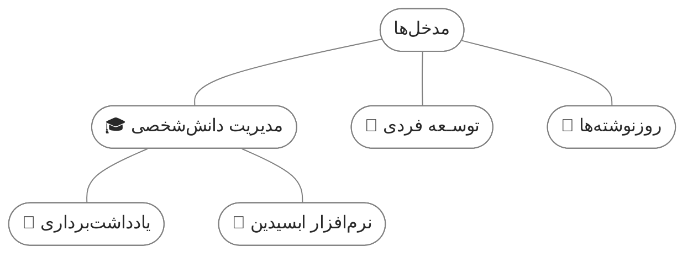

## کالوت های من

> [!empty] 🔍 شفاف
> لورم ایپسوم متن ساختگی با تولید سادگی نامفهوم از صنعت چاپ.

> [!gray] 📄 خاکستری
> لورم ایپسوم متن ساختگی با تولید سادگی نامفهوم از صنعت چاپ.

> [!yellow] ☀️ زرد
> لورم ایپسوم متن ساختگی با تولید سادگی نامفهوم از صنعت چاپ.

> [!orange] 🍊 نارنجی
> لورم ایپسوم متن ساختگی با تولید سادگی نامفهوم از صنعت چاپ.

> [!red] 🍎 قرمز
> لورم ایپسوم متن ساختگی با تولید سادگی نامفهوم از صنعت چاپ.

> [!blue] 🧊 آبی
> لورم ایپسوم متن ساختگی با تولید سادگی نامفهوم از صنعت چاپ.

> [!green] 🍏 سبز
> لورم ایپسوم متن ساختگی با تولید سادگی نامفهوم از صنعت چاپ.

> [!purple] 🍇 بنفش
> لورم ایپسوم متن ساختگی با تولید سادگی نامفهوم از صنعت چاپ.

> [!brown] 💼 قهوه‌ای
> لورم ایپسوم متن ساختگی با تولید سادگی نامفهوم از صنعت چاپ.

  

## کالوت های سیستم
> [!quote] نقل قول

> [!NOTE] یادداشت

> [!abstract] خلاصه

> [!info] اطلاعات

> [!todo] تو دو

> [!tip] نکته

> [!success] تیک

  

> [!warning] توجه

> [!question] سوال

> [!example] مثال

  

> [!failure]

> [!danger] 

> [!bug] 

## اسلایدر

<iframe width="100%" height="290px" style="border: none; border-radius: 10px;" src="before-after-404-v5.html"></iframe>

  

## دکمه
**باز کردن در تب جدید**

<button 
	class="my-button"	onclick="window.open('/', '_blank');">
    <svg xmlns="http://www.w3.org/2000/svg" viewBox="0 0 512 512" width="1em" height="1em" fill="currentColor"><path d="M288 32c0-17.7-14.3-32-32-32s-32 14.3-32 32l0 242.7-73.4-73.4c-12.5-12.5-32.8-12.5-45.3 0s-12.5 32.8 0 45.3l128 128c12.5 12.5 32.8 12.5 45.3 0l128-128c12.5-12.5 12.5-32.8 0-45.3s-32.8-12.5-45.3 0L288 274.7 288 32zM64 352c-35.3 0-64 28.7-64 64l0 32c0 35.3 28.7 64 64 64l384 0c35.3 0 64-28.7 64-64l0-32c0-35.3-28.7-64-64-64l-101.5 0-45.3 45.3c-25 25-65.5 25-90.5 0L165.5 352 64 352zm368 56a24 24 0 1 1 0 48 24 24 0 1 1 0-48z"/></svg> دانلود
</button>

**باز کردن در تب فعلی**

<button 
	class="my-button"	onclick="location.href='/';">
     بازگشت به صفحه اصلی
     <svg xmlns="http://www.w3.org/2000/svg" viewBox="0 0 320 512" width="1.1em" height="1.1em" fill="currentColor" style="vertical-align: middle;"><path d="M41.4 233.4c-12.5 12.5-12.5 32.8 0 45.3l160 160c12.5 12.5 32.8 12.5 45.3 0s12.5-32.8 0-45.3L109.3 256 246.6 118.6c12.5-12.5 12.5-32.8 0-45.3s-32.8-12.5-45.3 0l-160 160z"/></svg>
</button>

  

## دیاگرام

  

